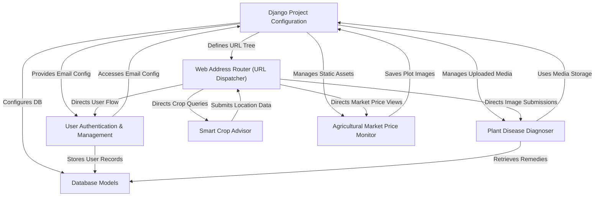

# Tutorial: Agri-Management-System

The Agri-Management-System is a comprehensive *web application* designed to empower farmers. It provides an intelligent **Plant Disease Diagnoser** that identifies crop ailments from uploaded leaf images and offers specific remedies. Additionally, it features a **Smart Crop Advisor** that suggests optimal crops based on real-time location and weather data, and an **Agricultural Market Price Monitor** that visualizes current commodity prices to aid informed selling decisions.

## Visual Overview

## Chapters

1. [User Authentication & Management](readme_files/01_user_authentication___management_.md)
2. [Web Address Router (URL Dispatcher)](readme_files/02_web_address_router__url_dispatcher__.md)
3. [Plant Disease Diagnoser](readme_files/03_plant_disease_diagnoser_.md)
4. [Smart Crop Advisor](readme_files/04_smart_crop_advisor_.md)
5. [Agricultural Market Price Monitor](readme_files/05_agricultural_market_price_monitor_.md)
6. [Django Project Configuration](readme_files/06_django_project_configuration_.md)
7. [Database Models](readme_files/07_database_models_.md)

---

© 2025 [Pandiarajan D](https://github.com/itz-me-pandian). Educational Purpose.