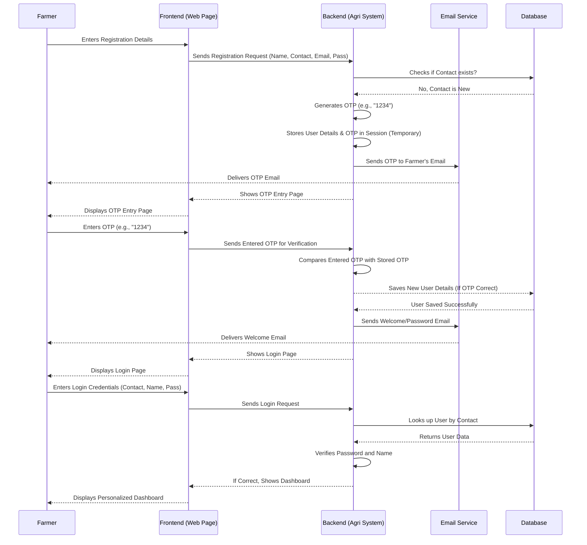

# Chapter 1: User Authentication & Management

Welcome to the Agri-Management-System project! In this first chapter, we're going to explore a fundamental part of almost every modern application: **User Authentication & Management**. Think of it as the system's security guard and enrollment office rolled into one!

### Why Do We Need Authentication and Management?

Imagine you're a farmer using our Agri-Management-System. You want to track your specific crops, get personalized disease diagnoses, or view market prices relevant to your farm. This is your personal space in the system. But how does the system know it's *you*? And how does it make sure no one else can access *your* farm data?

This is where User Authentication & Management comes in! It solves the problem of:

1.  **Knowing Who You Are (Authentication)**: When you log in, the system verifies your identity, ensuring you are who you claim to be.
2.  **Controlling Access (Authorization)**: Once your identity is confirmed, the system decides what features and data you're allowed to see or change.
3.  **Handling Your Details (Management)**: It securely stores your account information, like your name, contact, and email.

Essentially, it's like a special pass system. You first register to get your pass, then you use it to log in and access your personalized tools.

### Key Concepts

Let's break down the main ideas in User Authentication & Management:

*   **Registration (Signing Up)**: This is when a new farmer creates an account for the very first time. They provide basic details like their name, contact, and email, and set up a password.
*   **OTP Verification**: "OTP" stands for "One-Time Password". After registration, the system sends a unique, temporary code to the farmer's email. This extra step helps verify that the email address belongs to the farmer, adding a layer of security.
*   **Login (Signing In)**: Once registered and verified, farmers can log in using their contact number (which acts as an ID) and password to access their account.
*   **User Management**: This refers to all the behind-the-scenes work of storing, updating, and securing farmer accounts in the system's database.

### How a Farmer Uses It: A Step-by-Step Walkthrough

Let's see how a farmer interacts with these features in our Agri-Management-System.

#### Step 1: Registering as a New User

A new farmer wants to join the system. They would go to a registration page, like this one:

```html
<!-- Simplified from agmt/detector/templates/myapp/userreg.html -->
<form name="user_registration" method="post" action="" onsubmit="return validateForm()">
    <h1>Hello Farmer!</h1>
    <h2>Register here with your details !!!</h2>

    <label for="tuid">Contact :</label>
    <input type="number" id="tuid" name="tuid" required><br>

    <label for="tuname">Name :</label>
    <input type="text" id="tuname" name="tuname" required><br>

    <label for="tuemail">Email :</label>
    <input type="email" id="tuemail" name="tuemail" required><br>

    <label for="tpassword">Password :</label>
    <input type="password" id="tpassword" name="tpassword" required><br>

    <label for="tconfirmpassword">Confirm Password:</label>
    <input type="password" id="tconfirmpassword" name="tconfirmpassword" required><br>

    <p id="error-message"></p>
    <input type="submit" name="reg" value="Get OTP">
</form>
```
In this form, the farmer provides their contact number (which is their unique identifier in this system), name, email, and creates a password. When they click "Get OTP," the system processes their details and prepares for verification.

#### Step 2: OTP Verification

After submitting the registration form, the system sends an OTP to the farmer's email. The farmer then lands on an OTP verification page:

```html
<!-- Simplified from agmt/detector/templates/myapp/otp.html -->
<div class="container">
    <h1>OTP Verification</h1>
    <h3>Hi <span style="text-transform: uppercase;">{{ user }} !</span></h3>
    <h4>Enter the OTP sent to your mail to complete Registration</h4>
    <form id="otpForm" action="/verify_otp/" method="POST">
        
        <div id="otpInputContainer">
            <input type="text" id="otp1" name="otp1" maxlength="1" required>
            <input type="text" id="otp2" name="otp2" maxlength="1" required>
            <input type="text" id="otp3" name="otp3" maxlength="1" required>
            <input type="text" id="otp4" name="otp4" maxlength="1" required>
        </div>
        <button type="submit">Verify OTP</button>
    </form>
</div>
```
The farmer checks their email, finds the OTP, and enters each digit into the boxes. If the OTP matches, their registration is complete! They can now log in.

#### Step 3: Logging In

Once registered and verified, the farmer can visit the login page:

```html
<!-- Simplified from agmt/detector/templates/myapp/login.html -->
<div class="container">
    <h1>Login with your details !</h1>
    <form method="POST" action="">
        
        <label for="name">Farmer Name: Mr/Mrs. </label>
        <input type="text" id="name" name="name" required>
        
        <label for="contact_number">Contact Number:</label>
        <input type="number" id="contact_number" name="contact_number" required>
        
        <label for="password">Password:</label>
        <input type="password" id="password" name="password" required>
        
        <div class="button-container">
            <input type="submit" value="Login">
        </div>
    </form>
</div>
```
Here, the farmer enters their name, contact number, and password. If these credentials are correct, they gain access to their personalized dashboard.

#### Step 4: Accessing the Dashboard

Upon successful login, the farmer is directed to their personalized dashboard, where they can see their details and access various features:

```html
<!-- Simplified from agmt/detector/templates/myapp/viewprofile.html -->
<div class="container">
    <h1>User Dashboard</h1>
    <div class="form-group">
        <div class="form-label welcome-message">HELLO ! THIS IS Mr./Mrs. <span style="text-transform: uppercase;">{{ user.uname }} </span>!!</div><br><br>
    </div>
    <div class="form-group">
        <div class="form-label">Contact Number</div>
        <div class="colon">:</div>
        <div class="form-input">{{ user.id }}</div>
    </div>
    <div class="form-group">
        <div class="form-label">Email</div>
        <div class="colon">:</div>
        <div class="form-input">{{ user.uemail }}</div>
    </div>
</div>

<div class="button-container">
    <a href="/commodities" class="button">Commodity Rate Visualization</a>
    <a href="/crop_recommendation" class="button">Crop Recommendation</a>
    <a href="/imageinput" class="button">Disease Detection</a>
    <a href="javascript:history.back()" class="back-button">Log out</a>
</div>
```
This page displays the farmer's information and provides links to other parts of the Agri-Management-System, like "Commodity Rate Visualization" or "Disease Detection".

### How It Works Behind the Scenes: The Internal Implementation

Now, let's peek under the hood to understand how our system handles all this user information.

#### The Overall Flow

Here’s a simplified sequence of actions when a farmer registers and logs in:



#### The User Blueprint: Database Model

Before we can store any user information, we need a blueprint for what a "User" looks like in our database. This blueprint is called a **Model** in Django (the framework we use for the backend).

Here's the `User` model from `agmt/detector/models.py`:

```python
# File: agmt/detector/models.py

from django.db import models

class User(models.Model):
    # This stores the farmer's unique contact number
    uname = models.CharField(max_length=30)
    # This stores the farmer's password
    upass = models.CharField(max_length=25, default='')
    # This stores the farmer's email address
    uemail = models.EmailField()

    def __str__(self):
        return self.uname
    
    class Meta:
        # This tells Django to name the table "user" in the database
        db_table = "user"
```
*   `uname`: `CharField` means it's for text, `max_length=30` means it can store up to 30 characters. This will hold the farmer's name.
*   `upass`: Another `CharField` for the password. `default=''` means if a password isn't provided, it defaults to an empty string.
*   `uemail`: `EmailField` is a special `CharField` that ensures the input looks like a valid email address.
*   `id`: Notice there's no explicit `id` field here. Django automatically adds an `id` field as the primary key (a unique identifier) for every model. In our case, the `tuid` (contact number) from the form is used as this `id` when creating a `User` object.
*   `db_table = "user"`: This line simply tells our system that the actual table in the database will be named `user`.

This `User` model defines the structure for each farmer's account record in our database.

#### The Brains: Backend Logic (Views)

The logic for handling registration, OTP, and login lives in Python functions called **Views**. These functions process requests from the web pages and interact with the database and email service.

##### 1. Registering a New User (`insertuser` function)

When a farmer submits the registration form, the `insertuser` function in `agmt/detector/views.py` springs into action:

```python
# File: agmt/detector/views.py (simplified)

import random
from django.core.mail import send_mail
from .models import User # Our User blueprint

def insertuser(request):
    vuid = request.POST.get('tuid')      # Get contact from form
    vuname = request.POST.get('tuname')  # Get name from form
    vuemail = request.POST.get('tuemail')# Get email from form
    vpass = request.POST.get('tpassword')# Get password from form

    try:
        # Try to find a user with this contact number
        User.objects.get(id=vuid)
        # If found, it means the user already exists.
        # We send an error message and show the registration page again.
        # ... (error handling code omitted for brevity)
    except User.DoesNotExist: # If no user found with this contact
        # Generate a random 4-digit OTP
        otp = str(random.randint(1000, 9999))
        
        # Store user details and OTP temporarily in the 'session'.
        # The session is like a temporary memory for the user's current visit.
        request.session['otp'] = otp
        request.session['vuid'] = vuid
        request.session['vuname'] = vuname
        request.session['vuemail'] = vuemail
        request.session['vpass'] = vpass

        # Send the OTP to the farmer's email
        send_mail(
            'OTP for Validating',
            f'Your OTP is: {otp}', # Simple message for explanation
            'alloteasyregofficial@gmail.com', # Our system's email
            [vuemail], # Farmer's email
            fail_silently=False,
        )
        # Show the OTP verification page
        return render(request, "myapp/otp.html", {'user': vuname})
```
This code does the following:
*   It grabs the details (contact, name, email, password) that the farmer typed into the form.
*   It checks if a user with that contact number already exists in our [Database Models](07_database_models_.md). If so, it shows an error.
*   If it's a new contact, it generates a random 4-digit number for the OTP.
*   It *temporarily* stores all the farmer's registration details and the generated OTP in something called `request.session`. This is important because we don't want to save the user to the database until they verify the OTP.
*   Finally, it sends an email with the OTP to the farmer's provided email address and then shows the OTP entry page.

##### 2. Verifying the OTP (`otp_verify` function)

When the farmer enters the OTP and clicks "Verify OTP," the `otp_verify` function takes over:

```python
# File: agmt/detector/views.py (simplified)

from django.core.mail import send_mail
from django.shortcuts import render # To display web pages
from .models import User # Our User blueprint

def otp_verify(request):
    # Get the 4 digits entered by the farmer
    votp = request.POST.get('otp1') + request.POST.get('otp2') + \
           request.POST.get('otp3') + request.POST.get('otp4')
    
    # Get the OTP that we stored earlier in the session
    uotp = request.session.get('otp')

    if(votp == uotp): # If the entered OTP matches the stored OTP
        # Retrieve the farmer's details that we temporarily saved in the session
        vuid = request.session.get('vuid')
        vuname = request.session.get('vuname')
        vuemail = request.session.get('vuemail')
        vupass = request.session.get('vpass')
        
        # Create a new User object using our blueprint and the retrieved details
        us = User(id=vuid, uname=vuname, upass=vupass, uemail=vuemail)
        us.save() # Save the new farmer's account to the database!

        # Send a final welcome email with their password (for confirmation)
        send_mail(
            'Password for login',
            f'Hi {vuname}, Your password is: {vupass}', # Simple message for explanation
            'alloteasyregofficial@gmail.com',
            [vuemail],
            fail_silently=True,
        )
        # Registration successful, show the login page
        return render(request, 'myapp/login.html', {})
    else:
        # OTP didn't match, show an error and display the OTP page again
        # ... (error handling code omitted)
        return render(request, 'myapp/otp.html', {})
```
Here's what this code does:
*   It combines the four digits the farmer entered to form a complete OTP.
*   It retrieves the *correct* OTP that was generated and stored in `request.session`.
*   If the entered OTP matches the stored OTP, it retrieves all the farmer's details from the `request.session`.
*   It then creates a new `User` object (an instance of our `User` model blueprint) and uses `us.save()` to permanently store these details in the [Database Models](07_database_models_.md).
*   A confirmation email is sent to the farmer with their password, and they are redirected to the login page.
*   If the OTP doesn't match, an error message is shown, and the farmer stays on the OTP page.

##### 3. Logging In (`login_check` function)

When a farmer tries to log in, the `login_check` function handles the verification:

```python
# File: agmt/detector/views.py (simplified)

from django.shortcuts import render, redirect, get_object_or_404
from .models import User # Our User blueprint

def login_check(request):
    if request.method == 'POST': # Only process if form was submitted
        id = request.POST.get('contact_number') # Get contact from form
        uname = request.POST.get('name')         # Get name from form
        password = request.POST.get('password')  # Get password from form
        
        try:
            # Try to find a user in the database using the provided contact ID
            user = User.objects.get(id=id)

        except User.DoesNotExist:
            # If no user found, show an error and return to login page
            # ... (error handling code omitted)
            return render(request, "myapp/login.html", {})
        
        # Check if the provided password and username match the user found
        if user.upass == password and user.uname == uname:
            # Success! Show the user's dashboard
            return render(request, "myapp/viewprofile.html", {'user': user})
        else:
            # Password or username didn't match, show an error
            # ... (error handling code omitted)
            return render(request, "myapp/login.html", {})
    else:
        # If not a POST request (e.g., direct URL access), redirect to login
        return redirect('login')
```
This function:
*   Receives the contact number, name, and password entered by the farmer.
*   It attempts to find a `User` in the database using the provided contact number.
*   If no user is found with that contact, an error is displayed.
*   If a user is found, it compares the entered password and name with the `upass` and `uname` stored in the database for that user.
*   If everything matches, the farmer is successfully logged in and taken to their `viewprofile.html` dashboard. If not, an error message is shown.

### Conclusion

In this chapter, we learned about the crucial role of **User Authentication & Management** in our Agri-Management-System. We saw how farmers register, verify their identity with an OTP, and log in to access their personalized dashboard. We also took a look at the `User` model that defines how user data is stored and the Python functions (views) that handle the logic for these processes.

This user system acts as the foundation, allowing us to build personalized features for each farmer. But how do different parts of our system, like "register" or "login," get their specific web addresses? We'll explore this in the next chapter: [Web Address Router (URL Dispatcher)](02_web_address_router__url_dispatcher__.md).

---

<sub><sup>**References**: [[1]](https://github.com/itz-me-pandian/Agri-Management-System/blob/23cac15d4ba833e8d5a77db1b8269b72e3f1e993/agmt/detector/models.py), [[2]](https://github.com/itz-me-pandian/Agri-Management-System/blob/23cac15d4ba833e8d5a77db1b8269b72e3f1e993/agmt/detector/templates/myapp/index.html), [[3]](https://github.com/itz-me-pandian/Agri-Management-System/blob/23cac15d4ba833e8d5a77db1b8269b72e3f1e993/agmt/detector/templates/myapp/login.html), [[4]](https://github.com/itz-me-pandian/Agri-Management-System/blob/23cac15d4ba833e8d5a77db1b8269b72e3f1e993/agmt/detector/templates/myapp/otp.html), [[5]](https://github.com/itz-me-pandian/Agri-Management-System/blob/23cac15d4ba833e8d5a77db1b8269b72e3f1e993/agmt/detector/templates/myapp/userreg.html), [[6]](https://github.com/itz-me-pandian/Agri-Management-System/blob/23cac15d4ba833e8d5a77db1b8269b72e3f1e993/agmt/detector/templates/myapp/viewprofile.html), [[7]](https://github.com/itz-me-pandian/Agri-Management-System/blob/23cac15d4ba833e8d5a77db1b8269b72e3f1e993/agmt/detector/views.py)</sup></sub>