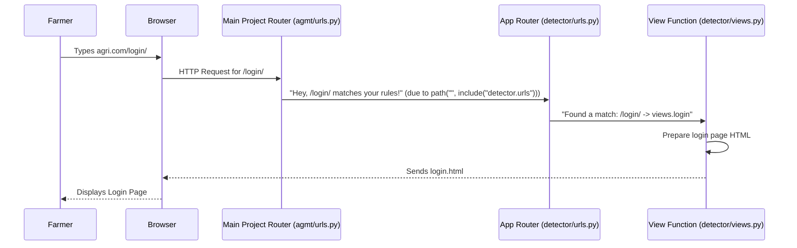

# Chapter 2: Web Address Router (URL Dispatcher)

Welcome back! In [Chapter 1: User Authentication & Management](01_user_authentication___management_.md), we learned how farmers register, log in, and get their identity verified. We saw how different web pages (like the registration form, OTP verification, and login page) are displayed.

But have you ever wondered how, when you type a web address like `agri.com/login` into your browser, the Agri-Management-System *knows* to show you the login page, and not, say, the registration page? Or how `agri.com/register` shows the registration page?

This is where the **Web Address Router**, also known as the **URL Dispatcher**, comes into play!

### What Problem Does the Web Address Router Solve?

Think of our Agri-Management-System as a big office building. Inside this building, there are many different departments, each responsible for a specific task:
*   One department handles new farmer registrations.
*   Another handles farmer logins.
*   A third might be responsible for showing crop recommendations.
*   And so on.

When you, as a farmer, want to access a specific service (like logging in), you don't just shout into the building. Instead, you use a specific **address** (a URL) which is like telling the main reception: "I want to go to the Login Department!"

The Web Address Router is that super-smart **receptionist** or **switchboard**. Its job is to:
1.  Listen for incoming web addresses (URLs).
2.  Look at the address you provided.
3.  Figure out exactly which "department" (which piece of Python code, called a **view function**) in our Agri-Management-System should handle your request.
4.  Direct your request to that specific department.

This ensures that every unique web address leads to the correct action or web page within our system. Without it, our system wouldn't know what to do with all the different web requests!

### Key Concepts of a Web Address Router

Let's break down the main ideas that make up our Web Address Router:

*   **URL (Uniform Resource Locator):** This is the web address itself, like `agri.com/login`. It's what you type into your browser.
*   **View Function:** This is a Python function in our Agri-Management-System's code that performs a specific task. For example, `login` is a view function that displays the login page or checks login credentials.
*   **URL Pattern:** This is a small piece of text that matches a part of the URL. For example, the pattern `'login/'` would match `/login` in `agri.com/login`.
*   **`path()` function:** This is a special function we use to link a URL Pattern to a View Function. It's like telling our receptionist: "If someone asks for *this pattern*, send them to *this view function*."
*   **`urlpatterns` List:** This is a list (a collection) of all the `path()` functions. It's the receptionist's complete directory of all departments and their addresses.
*   **`include()` function:** Our Agri-Management-System is made up of different smaller applications (like `detector` for user stuff, `croprecommendation` for crops). The `include()` function allows us to group all the URL patterns for one app together. It's like the main office building's receptionist saying: "For anything about 'crop recommendation', go talk to the 'Crop Recommendation' building's receptionist."

### How Our System Uses the Router: A Walkthrough

Let's see how our Agri-Management-System uses these concepts to handle requests for the login and registration pages, which we explored in Chapter 1.

#### Example: Going to the Login Page

1.  **You open your browser and type:** `http://localhost:8000/login/` (assuming our system is running locally).
2.  The browser sends this request to our Agri-Management-System.
3.  The Web Address Router looks at `/login/`.
4.  It finds a rule that says: "If the URL matches `'login/'`, call the `login` view function."
5.  The `login` view function then prepares and sends back the HTML for the login page.
6.  Your browser displays the login page!

#### Example: Accessing the Registration Page

Similarly, if you go to `http://localhost:8000/userreg/`:
1.  The Web Address Router looks at `/userreg/`.
2.  It finds a rule: "If the URL matches `'userreg/'`, call the `userreg` view function."
3.  The `userreg` view function sends back the HTML for the registration page.
4.  Your browser displays the registration page!

Notice how simple and clear this makes navigating our system. Every distinct action has a distinct web address and a specific piece of code ready to handle it.

### Behind the Scenes: The Router's Configuration

Now, let's peek at the code that sets up this routing system.

Our Agri-Management-System uses Django, a powerful web framework. Django uses Python files to define these URL patterns.

#### Step 1: The Main Project Router (`agmt/agmt/urls.py`)

Every Django project has a main `urls.py` file. This is the **main receptionist** for our entire Agri-Management-System. It mostly directs traffic to the smaller "app-specific" routers.

```python
# File: agmt/agmt/urls.py (simplified)
from django.contrib import admin
from django.urls import include, path # We need these functions

urlpatterns = [
    path("admin/", admin.site.urls), # Rule for Django's admin panel
    path("", include("detector.urls")), # Directs to 'detector' app's URLs
    path("recommend/", include('croprecommendation.urls')), # Directs to 'croprecommendation' app's URLs
]
```
*   `urlpatterns`: This is the list of all our URL rules.
*   `path("admin/", admin.site.urls)`: This rule says, "If the address starts with `/admin/`, let Django's built-in admin system handle it."
*   `path("", include("detector.urls"))`: This is very important! It says, "If the address starts with *nothing* (an empty string `""`), then go and look at the `urlpatterns` defined inside the `detector` app's `urls.py` file." This means our `detector` app (which handles user authentication) will manage many of our main paths.
*   `path("recommend/", include('croprecommendation.urls'))`: This says, "If the address starts with `/recommend/`, then let the `croprecommendation` app's `urls.py` handle it."

This `include()` function makes our routing organized. Instead of one giant list of rules, we have smaller, manageable lists for each part of our system.

#### Step 2: The App-Specific Router (`agmt/detector/urls.py`)

Now let's look at the `detector` app's `urls.py` file. This is like the **receptionist for the 'User Management' department**. It has specific rules for user-related actions.

```python
# File: agmt/detector/urls.py (simplified)
from django.urls import path
from . import views # We import our view functions from the 'views.py' file

urlpatterns = [
    path('', views.home, name='home'),             # Matches "" to views.home
    path('userreg/', views.userreg, name='userreg'), # Matches "/userreg/" to views.userreg
    path('insertuser/', views.insertuser, name='insertuser'), # Matches "/insertuser/" to views.insertuser
    path('login/', views.login, name='login'),     # Matches "/login/" to views.login
    path('login_check/', views.login_check, name='login_check'), # Matches "/login_check/" to views.login_check
    path('verify_otp/', views.otp_verify, name='verify_otp'), # Matches "/verify_otp/" to views.otp_verify
    # ... other paths for disease detection, commodities, etc.
]
```
In this file:
*   `from . import views`: This line imports all the "view functions" (like `home`, `userreg`, `login`, etc.) from the `views.py` file within the *same folder* (`detector`).
*   `path('userreg/', views.userreg, name='userreg')`: This is a specific rule.
    *   `'userreg/'`: This is the URL pattern. If the browser requests `.../userreg/`, this rule applies.
    *   `views.userreg`: This is the view function that will be called. This function is responsible for showing the registration page.
    *   `name='userreg'`: This gives this URL pattern a friendly name. We can use this name in our HTML templates (e.g., ``) to link to this page without hardcoding the URL. This is super helpful because if we ever change the URL pattern from `'userreg/'` to `'register_new_farmer/'`, we only need to change it here, not in every single HTML file!

#### Step 3: The View Functions (`agmt/detector/views.py`)

Finally, let's look at the actual "departments" (view functions) that the router directs requests to. These are the Python functions that do the real work.

```python
# File: agmt/detector/views.py (simplified)
from django.shortcuts import render

def userreg(request):
    # This view function simply shows the user registration page.
    # It sends the HTML from 'myapp/userreg.html' back to the browser.
    return render(request, "myapp/userreg.html")

def login(request):
    # This view function simply shows the login page.
    # It sends the HTML from 'myapp/login.html' back to the browser.
    return render(request, "myapp/login.html")

# Other view functions like insertuser, otp_verify, and login_check
# perform actions (saving data, checking OTP) as discussed in Chapter 1.
# After completing their action, they might render another page or redirect.
```
*   `def userreg(request):` and `def login(request):`: These are Python functions. When the Web Address Router matches a URL pattern to these functions, they are called.
*   `return render(request, "myapp/userreg.html")`: This line tells Django to take the `userreg.html` template, fill in any dynamic data, and send it as the response back to the user's browser.

#### The Flow in Action (Simplified):


This diagram shows the journey of a request for `/login/`. The `Main Project Router` first directs it to the `App Router` for the `detector` app, which then finds the correct `View Function` to handle it and send back the login page.

#### Another App's Router Example (`agmt/croprecommendation/urls.py`)

Just like the `detector` app, other parts of our system have their own routers. The `croprecommendation` app (which we'll explore in a later chapter) also has its own `urls.py`:

```python
# File: agmt/croprecommendation/urls.py (simplified)
from django.urls import path
from . import views # Imports views from this app's views.py

urlpatterns = [
    path('', views.map, name='map'), # Matches "" (relative to "/recommend/") to views.map
    path('save_data/', views.save_data, name='save'), # Matches "save_data/" to views.save_data
]
```
When you go to `agri.com/recommend/`, the `Main Project Router` directs the request to this `croprecommendation/urls.py`. Here, `path('', views.map, name='map')` means that if the URL is *just* `agri.com/recommend/` (because of the `include("recommend/")` in the main urls.py), it will call the `views.map` function to show the map for crop recommendation.

### Conclusion

In this chapter, we unraveled the mystery of the **Web Address Router (URL Dispatcher)**. We learned that it acts as the central switchboard for our Agri-Management-System, expertly directing incoming web addresses (URLs) to the correct Python functions (view functions) that handle specific tasks like showing a login page or processing registration data. By using `path()` to define rules and `include()` to organize them across different apps, our system maintains clarity and order in how it responds to user requests.

This routing system is fundamental, allowing different parts of our application to have unique, accessible web addresses. Next, we'll dive into one of the exciting features that uses this routing: [Plant Disease Diagnoser](03_plant_disease_diagnoser_.md), where farmers can upload images to check for diseases.

---

<sub><sup>**References**: [[1]](https://github.com/itz-me-pandian/Agri-Management-System/blob/23cac15d4ba833e8d5a77db1b8269b72e3f1e993/agmt/agmt/urls.py), [[2]](https://github.com/itz-me-pandian/Agri-Management-System/blob/23cac15d4ba833e8d5a77db1b8269b72e3f1e993/agmt/croprecommendation/urls.py), [[3]](https://github.com/itz-me-pandian/Agri-Management-System/blob/23cac15d4ba833e8d5a77db1b8269b72e3f1e993/agmt/detector/urls.py)</sup></sub>