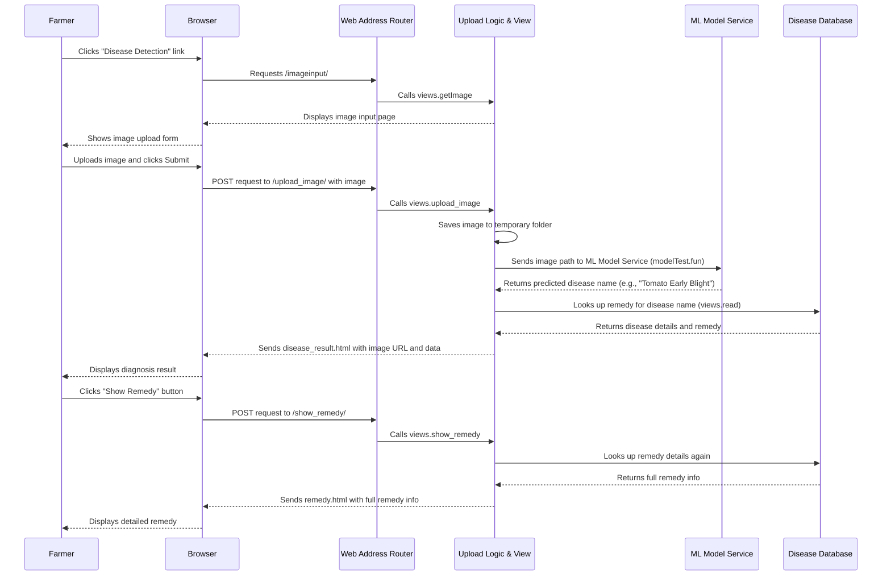

# Chapter 3: Plant Disease Diagnoser

Welcome back, future digital farmers! In [Chapter 2: Web Address Router (URL Dispatcher)](02_web_address_router__url_dispatcher__.md), we learned how our Agri-Management-System uses web addresses to guide you to the right place, whether it's the login page or a registration form. Now, we're going to put that routing to good use by diving into one of the most exciting and helpful features for farmers: the **Plant Disease Diagnoser**!

### What Problem Does the Plant Disease Diagnoser Solve?

Imagine this: You're a farmer, carefully tending to your tomato plants. One morning, you notice some strange spots on the leaves. Are they normal? Is it a dangerous disease? What should you do? Panic might set in because identifying plant diseases and knowing the right treatment can be really tough, even for experienced farmers.

This is where our **Plant Disease Diagnoser** comes in! Think of it as your personal digital plant doctor. It solves the crucial problem of:

*   **Quick Identification:** It helps you quickly figure out *what* disease your plant has.
*   **Actionable Advice:** Once identified, it tells you *how* to treat it, providing clear remedies.

The core idea is simple: You take a picture of your sick plant's leaf, upload it to our system, and our "smart brain" analyzes the image to tell you the disease and its solution.

### Key Concepts

Let's break down the main ideas behind this digital plant doctor:

*   **Image Upload:** This is how you, the farmer, provide the "symptoms" (a picture of the affected leaf) to the system.
*   **Machine Learning Model (The "Smart Brain"):** This is the core intelligence. It's a special computer program that has been "trained" by looking at thousands of pictures of healthy and diseased plants. When it sees a new picture, it uses its training to predict which disease it is.
*   **Disease & Remedy Database:** Once the machine learning model identifies a disease, our system needs to know all about that disease: what causes it, how it spreads, and most importantly, how to treat it. This information is stored in a special database.
*   **Diagnosis Result:** This is what you see! It's the system's report, showing the predicted disease and the recommended remedy.

### How a Farmer Uses It: A Step-by-Step Walkthrough

Let's see how you, as a farmer, would interact with the Plant Disease Diagnoser.

#### Step 1: Navigating to the Diagnoser

From your [User Authentication & Management](01_user_authentication___management_.md) dashboard, you'd click on a link like "Disease Detection". This would take you to the image upload page.

#### Step 2: Uploading an Image

You would arrive at a page specifically designed for uploading images.

```html
<!-- Simplified from agmt/detector/templates/myapp/imageinput.html -->
<div class="container">
    <h2>Disease Detection</h2>
    <form action="" method="POST" enctype="multipart/form-data">
        
        <label for="imageUpload" class="upload-box">
            <span class="file-label">Click to Upload Image</span>
            <input type="file" id="imageUpload" name="image" accept="image/*" onchange="previewImage(event)">
        </label>
        <div class="preview-container">
            
        </div>
        <div class="button-container">
            <a href="javascript:history.back()" class="button">Back</a>
            <button type="submit" class="button">Submit</button>
        </div>
    </form>
</div>
```
Here's what happens:
*   You click the "Click to Upload Image" area.
*   Your computer or phone's file selector opens.
*   You choose a picture of your sick plant leaf.
*   The `onchange="previewImage(event)"` part ensures that a small preview of your uploaded image appears on the page.
*   You click "Submit" to send the image for diagnosis.

#### Step 3: Getting the Diagnosis

After clicking "Submit", the system processes your image. In a few moments, you'll see the diagnosis result:

```html
<!-- Simplified from agmt/detector/templates/myapp/disease_result.html -->
<div class="container">
    <h2>Disease Prediction Result</h2>
    
    

    <div class="details mt-3">
        
            <p><strong>Disease Detected :</strong> Yes </p>
            <p><strong>Disease Cause :</strong> {{ data.dcause }} </p>
            <form action="" method="POST">
                
                <input type="hidden" name="dname" value="{{ data.dname }}">
                <button type="submit" class="btn-show-remedy">Show Remedy</button>
                <div class="button-container">
                    <a href="javascript:history.back()" class="button">Back</a>
                </div>
            </form>
        
            <p><strong>No Disease Detected</strong></p>
            <p><strong>{{data.dname}}</strong></p>
             <div class="button-container">
                <a href="javascript:history.back()" class="button">Back</a>
            </div>
        
    </div>
</div>
```
On this page:
*   You see the image you uploaded.
*   The system tells you if a disease was detected.
*   If a disease *is* detected, it shows you the "Disease Cause" (e.g., Fungal infection).
*   A "Show Remedy" button appears, which you can click for detailed treatment instructions.
*   If no disease is detected, it happily informs you your plant is healthy!

#### Step 4: Viewing Remedy Details

If you clicked "Show Remedy", you'll be taken to a page with comprehensive information:

```html
<!-- Simplified from agmt/detector/templates/myapp/remedy.html -->
<div class="container">
    <h2>Detailed description of Disease</h2>
    <div class="details mt-3">
        <p><strong>Predicted Disease : </strong>{{ data.dname }}</p>
        <p><strong>Cause : </strong> {{ data.dcause }}</p>
        <p><strong>Type : </strong> {{ data.dtype }}</p>
        <div class="remedy-box">
            <strong>Remedy : </strong> {{ data.dremedy }}
        </div>
        <div class="button-container">
            <a href="javascript:history.back()" class="button">Back</a>
        </div>
    </div>
</div>
```
This page gives you all the crucial details: the disease name, its cause, its type (e.g., "Spreadable"), and the full remedy instructions.

### Behind the Scenes: The Digital Plant Doctor's Inner Workings

Now, let's peek under the hood to see how our Plant Disease Diagnoser actually works.

#### The Overall Flow

Here’s a simplified sequence of actions when you use the diagnoser:



#### The Blueprint for Remedies: Database Model

Before we can store any disease information and remedies, we need a blueprint for what a "Remedy" looks like in our database. This blueprint is called a **Model** in Django.

Here's the `Remedy` model from `agmt/detector/models.py`:

```python
# File: agmt/detector/models.py

from django.db import models

class Remedy(models.Model):
    # This stores the specific name of the disease
    dname = models.CharField(max_length=100)
    # This stores whether the disease is Spreadable or Not Spreadable
    dtype = models.CharField(max_length=100)
    # This describes what causes the disease (e.g., Fungal infection)
    dcause = models.CharField(max_length=200)
    # This contains the instructions for treating the disease
    dremedy = models.CharField(max_length=200)

    class Meta:
        # This tells Django to name the table "remedy" in the database
        db_table = "remedy"
```
*   `dname`: `CharField` for the disease name.
*   `dtype`: `CharField` for the disease type (e.g., "Spreadable").
*   `dcause`: `CharField` for the cause of the disease.
*   `dremedy`: `CharField` for the detailed treatment instructions.
*   Django automatically adds a unique `id` field for each remedy entry.

This `Remedy` model defines the structure for how all disease and remedy information is stored in our [Database Models](07_database_models_.md).

#### Populating the Remedy Data

Where does all this remedy information come from? We have a Python file that contains a list of tuples, each describing a disease and its remedy. This data can be "populated" (added) into our `Remedy` database table.

```python
# File: agmt/db/disease_data.py (simplified)
disease_data = [
    # (Disease Name, Disease Type, Disease Cause, Remedy)
    ("Apple Scab", "Spreadable", "Fungal infection (Venturia inaequalis)", "Use fungicides..."),
    ("Black Rot (Apple)", "Spreadable", "Fungal infection (Botryosphaeria obtusa)", "Remove infected fruits..."),
    # ... many more diseases ...
    ("Tomato (Healthy)", "Not Spreadable", "No disease", "Use proper fertilization."),
]

# File: agmt/detector/Remedy_populate.py (simplified)
from .models import Remedy

def createRemedy(val):
    if(val==1): # Only run if 'val' is 1
        # ... disease_data list would be here or imported ...
        for d_data in disease_data:
            dn,dt,dc,dr = d_data
            row = Remedy(dname=dn, dtype=dt, dcause=dc, dremedy=dr)
            row.save() # Saves each disease entry to the database
```
The `createRemedy` function iterates through this list and creates a new `Remedy` object for each entry, saving it to the database. This is a one-time process to set up our disease knowledge base.

#### The Brains: Backend Logic (Views)

The logic for handling image uploads, calling the ML model, and fetching remedies lives in Python functions called **Views**.

##### 1. Displaying the Upload Page (`getImage` function)

When you click "Disease Detection", the [Web Address Router](02_web_address_router__url_dispatcher__.md) directs you to this function:

```python
# File: agmt/detector/views.py

from django.shortcuts import render

def getImage(request):
    # This simply shows the image upload form page.
    return render(request,"myapp/imageinput.html",{})
```
This function is straightforward: it just renders (displays) the `imageinput.html` page to the user.

##### 2. Handling Image Upload and Diagnosis (`upload_image` function)

When you submit the image, this is the core function that orchestrates the diagnosis:

```python
# File: agmt/detector/views.py (simplified)

import os
import datetime
from django.shortcuts import render
from django.core.files.storage import FileSystemStorage
from django.conf import settings # Needed for MEDIA_ROOT/MEDIA_URL
import tensorflow as tf
import numpy as np
from . import modelTest # Our ML model
from .models import Remedy # Our Remedy blueprint

def upload_image(request):
    if request.method == 'POST' and request.FILES.get('image'):
        image = request.FILES['image'] # Get the uploaded image file

        # Save the image temporarily
        upload_dir = os.path.join(os.getcwd(), 'UploadedImages')
        os.makedirs(upload_dir, exist_ok=True)
        fs = FileSystemStorage(location=upload_dir)
        
        # Create a unique filename for the uploaded image
        name, ext = os.path.splitext(image.name)
        timestamp = datetime.datetime.now().strftime("%Y_%m_%d_%H_%M_%S")
        new_filename = f"{name}_{timestamp}{ext}"
        filename = fs.save(new_filename, image) # Save the file
        image_path = os.path.join(upload_dir, filename) # Full path to saved image

        # --------------------- ML Model Prediction ---------------------
        # Our ML model (simplified for tutorial)
        # modelTest.fun takes the image path and returns the predicted disease name
        predicted_disease_name = modelTest.fun(image_path)
        # ---------------------------------------------------------------

        # Look up disease details and remedy from our database
        disease_info = read(predicted_disease_name) # Calls a helper function `read`

        # Prepare data to send to the result page
        data = {
            "dname": disease_info[0],
            "dcause": disease_info[1],
            "dtype": disease_info[2],
            "dremedy": disease_info[3]
        }
        
        # Construct the URL for the displayed image
        image_url = f"{settings.MEDIA_URL}UploadedImages/{filename}"

        context = {
            "image_url": image_url, 
            "predicted_disease": predicted_disease_name,
            "data": data 
        }
        return render(request, "myapp/disease_result.html", context)
    # ... (error handling for no image uploaded)
```
This function is quite busy:
*   It checks if an image was actually uploaded.
*   It securely saves the uploaded image to a folder on the server, giving it a unique name.
*   **Crucially, it then calls `modelTest.fun(image_path)`.** This `modelTest.fun` is where our machine learning model lives. It takes the image path, analyzes the picture, and returns the *predicted disease name* (e.g., "Tomato Early Blight"). We treat this as a "black box" for this tutorial – it just works its magic and gives us the answer!
*   It uses the predicted disease name to look up all the relevant details (cause, type, remedy) from our `Remedy` database using the `read` function.
*   Finally, it prepares all this information and the path to the uploaded image, then renders the `disease_result.html` page to show you the diagnosis.

##### 3. Reading Remedy Details from Database (`read` function)

This is a helper function that `upload_image` uses to get the remedy information:

```python
# File: agmt/detector/views.py

from .models import Remedy # Our Remedy blueprint

def read(disease):
    # Finds the matching disease entry in the database
    data = Remedy.objects.get(dname=disease)
    # Returns the disease name, cause, type, and remedy
    return data.dname, data.dcause, data.dtype, data.dremedy
```
This function simply takes the predicted `disease` name, searches our `Remedy` table in the database for an entry with that name, and returns all its stored details.

##### 4. Displaying Full Remedy (`show_remedy` function)

If you click the "Show Remedy" button, this function handles that request:

```python
# File: agmt/detector/views.py

from django.shortcuts import render
from .models import Remedy # Our Remedy blueprint

def show_remedy(request):
    if request.method == "POST":
        disease_name = request.POST.get("dname") # Get disease name from the button click
        # Fetch the full disease details from the database
        disease = Remedy.objects.get(dname=disease_name)
        # Render the remedy.html page with the detailed information
        return render(request, "myapp/remedy.html", {"data": disease})
```
This function receives the disease name from the `disease_result.html` page, fetches the complete `Remedy` object from the database, and then displays all its detailed information on the `remedy.html` page.

#### URL Routing for the Diagnoser

Just like user authentication, our [Web Address Router](02_web_address_router__url_dispatcher__.md) handles the addresses for the Plant Disease Diagnoser.

```python
# File: agmt/detector/urls.py (simplified)
from django.urls import path
from . import views # We import our view functions

urlpatterns = [
    # ... other paths ...
    path('imageinput', views.getImage, name='getImage'),           # For showing the upload form
    path('upload_image/', views.upload_image, name='upload_image'), # For processing the uploaded image
    path('show_remedy/', views.show_remedy, name='show_remedy'),   # For showing detailed remedies
    # ... other paths ...
]
```
*   `path('imageinput', views.getImage, name='getImage')`: When a farmer goes to `/imageinput`, the `getImage` view function is called to display the image upload form.
*   `path('upload_image/', views.upload_image, name='upload_image')`: When the farmer submits the form with an image, it sends a `POST` request to `/upload_image/`, which triggers the `upload_image` view function to do the diagnosis.
*   `path('show_remedy/', views.show_remedy, name='show_remedy')`: When the farmer clicks "Show Remedy" on the diagnosis page, this URL is accessed, and the `show_remedy` view function displays the detailed treatment.

### Conclusion

In this chapter, we explored the fascinating **Plant Disease Diagnoser**, a powerful tool within our Agri-Management-System. We learned how farmers can easily upload an image of a sick plant leaf, and how our system, powered by a smart machine learning model and a detailed disease database, provides an instant diagnosis and comprehensive remedy. We looked at the user-facing steps and dived into the backend code that handles image uploads, model predictions, and database lookups, all seamlessly connected by our URL routing system.

This feature truly empowers farmers by giving them immediate, actionable insights. But what if a farmer wants advice on which crop to grow in the first place? That's what we'll explore next in [Chapter 4: Smart Crop Advisor](04_smart_crop_advisor_.md).

---

<sub><sup>**References**: [[1]](https://github.com/itz-me-pandian/Agri-Management-System/blob/23cac15d4ba833e8d5a77db1b8269b72e3f1e993/agmt/db/disease_data.py), [[2]](https://github.com/itz-me-pandian/Agri-Management-System/blob/23cac15d4ba833e8d5a77db1b8269b72e3f1e993/agmt/detector/Remedy_populate.py), [[3]](https://github.com/itz-me-pandian/Agri-Management-System/blob/23cac15d4ba833e8d5a77db1b8269b72e3f1e993/agmt/detector/models.py), [[4]](https://github.com/itz-me-pandian/Agri-Management-System/blob/23cac15d4ba833e8d5a77db1b8269b72e3f1e993/agmt/detector/templates/myapp/disease_result.html), [[5]](https://github.com/itz-me-pandian/Agri-Management-System/blob/23cac15d4ba833e8d5a77db1b8269b72e3f1e993/agmt/detector/templates/myapp/imageinput.html), [[6]](https://github.com/itz-me-pandian/Agri-Management-System/blob/23cac15d4ba833e8d5a77db1b8269b72e3f1e993/agmt/detector/templates/myapp/remedy.html), [[7]](https://github.com/itz-me-pandian/Agri-Management-System/blob/23cac15d4ba833e8d5a77db1b8269b72e3f1e993/agmt/detector/views.py)</sup></sub>