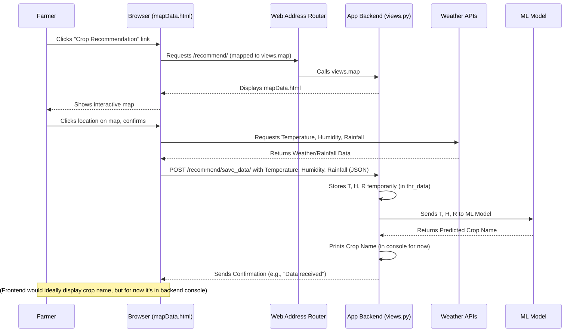

# Chapter 4: Smart Crop Advisor

Welcome back, digital farmers! In [Chapter 3: Plant Disease Diagnoser](03_plant_disease_diagnoser_.md), we learned how our system can act as a digital plant doctor, helping you identify diseases and find remedies. That's great for sick plants, but what if you're just starting a new season or have a new plot of land, and you're not sure *what* to plant to get the best harvest?

This is where our **Smart Crop Advisor** comes to the rescue!

### What Problem Does the Smart Crop Advisor Solve?

Choosing the right crop for your land is one of the most important decisions a farmer makes. Plant a crop that doesn't like your local weather or soil, and you might end up with a very small yield, or even a failed harvest. Factors like temperature, humidity, and rainfall vary greatly from one location to another, and even season to season.

Imagine you're a farmer with a new piece of land. You want to maximize your yield and profit, but you're unsure if cotton, rice, or maybe even mangoes would thrive there. Consulting an expert agronomist can be costly and time-consuming.

Our **Smart Crop Advisor** solves this problem by acting as your personal, digital agricultural expert. It helps you:

*   **Make Informed Decisions:** Get recommendations based on real environmental data for your specific location.
*   **Boost Yields:** Plant crops that are most likely to flourish in your local conditions.
*   **Save Time and Money:** Avoid trial-and-error planting by getting smart advice upfront.

The core idea is simple: You show our system where your land is on a map, and it tells you the best crop to plant there!

### Key Concepts

Let's break down the main ideas that make up our Smart Crop Advisor:

*   **Map Selection:** This is how you, the farmer, pinpoint your exact land location on a map.
*   **Local Weather Data:** Once you select a spot, our system fetches real-time (or recent historical) weather information like temperature, humidity, and rainfall for that specific area.
*   **Machine Learning Model (The "Crop Brain"):** This is a sophisticated computer program that has been "trained" on a massive dataset of successful crop growth under various environmental conditions. It uses this knowledge to predict the most suitable crop for *your* conditions.
*   **Crop Recommendation:** This is the final advice – the name of the crop (or crops) that our system believes will give you the best results.

### How a Farmer Uses It: A Step-by-Step Walkthrough

Let's see how you would use the Smart Crop Advisor in our Agri-Management-System.

#### Step 1: Navigating to the Crop Advisor

From your [User Authentication & Management](01_user_authentication___management_.md) dashboard, you'd click on a link like "Crop Recommendation". This would take you to the interactive map page.

#### Step 2: Selecting Your Location on the Map

You would see a large map, probably of India (our system's primary focus).

```html
<!-- Simplified from agmt/croprecommendation/templates/mapData.html -->
<body>
  <div class="map-container">
    <div id="map"></div> <!-- This is where the interactive map appears -->
  </div>

  <div class="info-box" id="infoBox">Click any location to view agricultural data</div>

  <!-- Confirmation Modal -->
  <div id="confirmModal">
    <div class="modal-backdrop"></div>
    <div class="modal-box">
      <p>Do you want to fetch and send data for this location?</p>
      <div class="modal-buttons">
        <button id="confirmYes">Yes</button>
        <button id="confirmNo">No</button>
      </div>
    </div>
  </div>
  <!-- ... rest of HTML ... -->
</body>
```
*   You use your mouse or finger to pan and zoom the map.
*   You then **click** on the precise location of your farm or the land you're interested in.
*   A small pop-up (**Confirmation Modal**) will appear asking if you want to fetch data for that location.

#### Step 3: Confirming Data Fetching

When the modal appears, you click "Yes".

```javascript
// Simplified JavaScript from mapData.html
map.on('click', (e) => {
  clickedLat = e.latlng.lat; // Get latitude
  clickedLng = e.latlng.lng; // Get longitude
  document.getElementById("confirmModal").style.display = "block"; // Show modal
});

document.getElementById("confirmYes").addEventListener("click", async () => {
  document.getElementById("confirmModal").style.display = "none"; // Hide modal

  // ... (code to add a marker to the map omitted) ...

  await fetchAgriculturalData(clickedLat, clickedLng); // Call function to get data
});
```
*   Upon clicking "Yes", the system will fetch local weather data (temperature, humidity) and recent rainfall for the clicked coordinates from external weather services.
*   This information will then be displayed in a visible **Info Box** on the map, showing you the fetched data.
*   Crucially, this data is also sent to the backend for the crop recommendation!

#### Step 4: Viewing the Recommended Crop

After the system fetches the data and sends it to the backend, the "Crop Brain" gets to work. The recommended crop will then be processed and displayed in the backend console (for now, in a real application, this would be sent back to the frontend).

For instance, if you clicked on a location with high rainfall and moderate temperature, the system might internally print something like:

```text
recommendation model loaded succesfull
[[35, 66, 81, 25.5, 78.2, 6.13, 250.7]]
rice
```
This output `rice` means the Smart Crop Advisor recommends rice for that location!

### Behind the Scenes: The Agronomist's Tools

Now, let's peek under the hood to see how our Smart Crop Advisor works its magic.

#### The Overall Flow

Here’s a simplified sequence of actions when you use the crop advisor:



#### URL Routing for the Crop Advisor

Our [Web Address Router](02_web_address_router__url_dispatcher__.md) directs traffic for the crop recommendation feature. Remember how the main `agmt/agmt/urls.py` sends anything starting with `/recommend/` to the `croprecommendation` app?

```python
# File: agmt/agmt/urls.py (simplified)
from django.urls import include, path

urlpatterns = [
    # ... other paths ...
    path("recommend/", include('croprecommendation.urls')), # Directs to 'croprecommendation' app's URLs
]
```
Then, inside the `croprecommendation` app, we have its own `urls.py`:

```python
# File: agmt/croprecommendation/urls.py
from django.urls import path
from . import views # We import our view functions from this app

urlpatterns = [
    path('', views.map, name='map'), # Matches "/recommend/" to views.map
    path('save_data/', views.save_data, name='save'), # Matches "/recommend/save_data/" to views.save_data
]
```
*   `path('', views.map, name='map')`: When you go to `/recommend/` (the base URL for this app), the `map` view function is called to display the `mapData.html` page.
*   `path('save_data/', views.save_data, name='save')`: After the frontend fetches weather data, it sends that data to `/recommend/save_data/`, which calls the `save_data` view function to process it.

#### The Frontend Magic: `mapData.html`

The `mapData.html` file uses a JavaScript library called Leaflet to display the interactive map. It handles the user's clicks, fetches external weather data, and then sends it to our backend.

```html
<!-- Simplified from agmt/croprecommendation/templates/mapData.html -->
<script src="https://unpkg.com/leaflet/dist/leaflet.js"></script>
<script>
  const map = L.map('map', { /* ... map settings ... */ });
  L.tileLayer('https://{s}.tile.openstreetmap.org/{z}/{x}/{y}.png', { /* ... tile layer ... */ }).addTo(map);

  map.on('click', (e) => { // When the map is clicked
    clickedLat = e.latlng.lat;
    clickedLng = e.latlng.lng;
    document.getElementById("confirmModal").style.display = "block"; // Show confirmation
  });

  document.getElementById("confirmYes").addEventListener("click", async () => {
    document.getElementById("confirmModal").style.display = "none";
    // This is where external weather data is fetched
    // (from api.openweathermap.org, api.open-meteo.com)
    // ... complex API calls simplified ...

    const t = /* fetched temperature */;
    const h = /* fetched humidity */;
    const r = /* fetched rainfall */;

    fetch('/recommend/save_data/', { // Sending data to our backend
      method: 'POST',
      headers: {
        'Content-Type': 'application/json',
        'X-CSRFToken': getCSRFToken(), // Security token
      },
      body: JSON.stringify({ temperature: t, humidity: h, rainfall: r })
    })
    .then(res => res.json())
    .then(data => console.log('Backend response:', data))
    .catch(err => console.error('Error sending data:', err));
  });
  // ... getCSRFToken function ...
</script>
```
This JavaScript code does a lot:
*   It sets up the map and listens for clicks.
*   When a click happens, it gets the latitude (`lat`) and longitude (`lng`) of that point.
*   It then calls external weather APIs to get the temperature, humidity, and rainfall for those coordinates.
*   Finally, it uses `fetch()` to send this collected `temperature`, `humidity`, and `rainfall` data as a JSON object to our backend's `/recommend/save_data/` URL. This is how the weather data reaches our "Crop Brain."

#### The Backend Logic: `views.py`

This is where our system receives the data, processes it with the Machine Learning model, and makes the recommendation.

First, the simple `map` function just displays the map page:

```python
# File: agmt/croprecommendation/views.py
from django.shortcuts import render

def map(request):
    # This simply shows the map page for crop recommendation.
    return render(request,"mapData.html")
```

Next, the `save_data` function receives the environmental data from the frontend:

```python
# File: agmt/croprecommendation/views.py
import json
from django.http import JsonResponse
from django.views.decorators.csrf import csrf_exempt

# A temporary storage for the current request's data
thr_data = {} 

@csrf_exempt # Allows POST requests without CSRF token for simplicity here
def save_data(request):
    if request.method == "POST":
        data = json.loads(request.body) # Get JSON data from frontend
        temperature = data.get("temperature")
        humidity = data.get("humidity")
        rainfall = data.get("rainfall")

        # Store data temporarily for the ML model to access
        thr_data["temperature"] = temperature
        thr_data["humidity"] = humidity
        thr_data["rainfall"] = rainfall

        # Call the function to get the crop recommendation
        recommend_crop() 

        return JsonResponse({"message": "Data received", "temperature": temperature})
    return JsonResponse({"error": "Invalid request"}, status=400)
```
*   `save_data` is called when the frontend sends the `POST` request with temperature, humidity, and rainfall.
*   It extracts these values from the incoming JSON data.
*   It stores them in a global dictionary `thr_data`. This is a quick way to pass the data to the `recommend_crop` function in this example.
*   Then, it calls `recommend_crop()` to get the actual recommendation.
*   It sends back a `JsonResponse` to the frontend, confirming receipt of the data.

Now, let's look at `recommend_crop` and `load_crop_recommendation_model`, which contain the "Crop Brain":

```python
# File: agmt/croprecommendation/views.py (simplified)
import pickle # To load our saved ML model

# ... (thr_data, map, save_data functions) ...

def load_crop_recommendation_model():
    # Load the pre-trained Machine Learning model
    with open("path/to/recommendation_model.pkl", "rb") as file:
        recommendation_model = pickle.load(file)
    print("recommendation model loaded successfully")

    # Get the environmental data from our temporary storage
    t = thr_data["temperature"]
    h = thr_data["humidity"]
    r = float(thr_data["rainfall"])

    # For this tutorial, NPK (Nitrogen, Phosphorus, Potassium)
    # and pH are fixed, but in a real system, they'd come from soil data.
    n = 35
    p = 66
    k = 81
    ph = 6.13

    # Prepare data in the format the ML model expects
    test_input = [[n, p, k, t, h, ph, r]]
    print(f"ML Model Input: {test_input}")

    # Make a prediction using the loaded model
    prediction = recommendation_model.predict(test_input)
    
    # List of crop names corresponding to model's numerical output
    label = [
        'rice','maize','chickpea','kidneybeans','pigeonpeas','mothbeans','mungbean',
        'blackgram','lentil','pomegranate','banana','mango','grapes','watermelon',
        'muskmelon','apple','orange','papaya','coconut','cotton','jute','coffee'
    ]
    
    # Return the predicted crop name
    print(f"Predicted crop index: {prediction[0]}")
    return label[prediction[0]]

def recommend_crop():
    crop = load_crop_recommendation_model() # Call the ML model
    print(f"Recommended Crop: {crop}") # Print the recommendation to the console
```
*   `load_crop_recommendation_model()` is the heart of the "Crop Brain":
    *   It uses `pickle.load()` to load a pre-trained Machine Learning model from a file (`recommendation_model.pkl`). This model is what learned patterns from past data.
    *   It retrieves the `temperature`, `humidity`, and `rainfall` from `thr_data`.
    *   It uses fixed values for `n` (Nitrogen), `p` (Phosphorus), `k` (Potassium), and `ph` (soil acidity), along with the environmental data, to create an input `test_input` for the model.
    *   `recommendation_model.predict(test_input)` is the magical line where the ML model takes the input data and gives an output: a number representing a crop.
    *   It then uses a `label` list to convert that number into a human-readable crop name (e.g., `0` might be "rice", `1` might be "maize").
*   `recommend_crop()` simply calls `load_crop_recommendation_model()` and prints the result to the console.

### Conclusion

In this chapter, we explored the incredible **Smart Crop Advisor**! We learned how farmers can simply click on a map to get tailored crop recommendations based on local weather conditions like temperature, humidity, and rainfall. We saw how the frontend collects this data and sends it to our backend, where a powerful Machine Learning model, our "Crop Brain," processes the information to suggest the optimal crop. This smart feature empowers farmers to make data-driven decisions for maximum yield.

Now that we can help farmers choose the right crop, how about helping them sell it at the best price? In the next chapter, we'll dive into the [Agricultural Market Price Monitor](05_agricultural_market_price_monitor_.md).

---


<sub><sup>**References**: [[1]](https://github.com/itz-me-pandian/Agri-Management-System/blob/23cac15d4ba833e8d5a77db1b8269b72e3f1e993/agmt/croprecommendation/templates/mapData.html), [[2]](https://github.com/itz-me-pandian/Agri-Management-System/blob/23cac15d4ba833e8d5a77db1b8269b72e3f1e993/agmt/croprecommendation/urls.py), [[3]](https://github.com/itz-me-pandian/Agri-Management-System/blob/23cac15d4ba833e8d5a77db1b8269b72e3f1e993/agmt/croprecommendation/views.py)</sup></sub>
