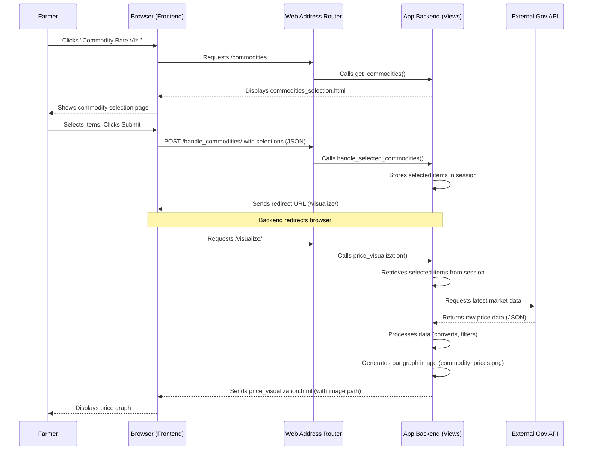

# Chapter 5: Agricultural Market Price Monitor

Welcome back, digital farmers! In [Chapter 4: Smart Crop Advisor](04_smart_crop_advisor_.md), we learned how our system helps you choose the *best crop to plant* for your land. That's a huge step towards a successful harvest! But once your crops are ready, a new challenge arises: *When and where should you sell them to get the best price?* Market prices for fruits and vegetables can change daily, sometimes even hourly, making it tricky to decide.

This is where our **Agricultural Market Price Monitor** comes in!

### What Problem Does the Agricultural Market Price Monitor Solve?

Imagine you've successfully grown a bumper crop of tomatoes. You want to sell them, but you hear conflicting reports about prices. Is today a good day to sell? Should you wait until tomorrow? Selling at the wrong time could mean losing out on significant income, impacting your farm's profitability.

Our **Agricultural Market Price Monitor** acts like your personal financial newspaper for farm produce. It solves this critical problem by:

*   **Providing Current Prices:** It shows you the most up-to-date market prices for various commodities.
*   **Highlighting Trends:** By visualizing prices, you can quickly spot if prices are high or low, helping you decide when to sell.
*   **Empowering Decisions:** With real-time information, you can make informed choices about your selling strategy, potentially increasing your profits.

The core idea is simple: You tell our system which fruits or vegetables you're interested in, and it shows you a clear graph of their current market prices.

### Key Concepts

Let's break down the main ideas behind this market intelligence tool:

*   **External Government API:** This is where we get our price data. Instead of collecting it ourselves, we rely on a government-provided service (an "API" stands for Application Programming Interface, which is a way for two computer systems to talk to each other) that gathers market prices from various sources.
*   **Commodity Selection:** You get to choose which specific fruits or vegetables you want to track prices for.
*   **Data Fetching:** Our system sends a request to the government API to pull in the latest price information.
*   **Data Processing:** The raw data from the API might need some cleaning and organizing to make it useful.
*   **Price Visualization:** This is how we make the data easy to understand. We turn numbers into a simple bar graph, so you can quickly see and compare prices.

### How a Farmer Uses It: A Step-by-Step Walkthrough

Let's see how you, as a farmer, would interact with the Agricultural Market Price Monitor.

#### Step 1: Navigating to the Price Monitor

From your [User Authentication & Management](01_user_authentication___management_.md) dashboard, you'd click on a link like "Commodity Rate Visualization". This takes you to a page where you can select the commodities you wish to monitor.

#### Step 2: Selecting Your Commodities

You will see a list of common agricultural commodities. You can check the boxes next to the ones you're interested in.

```html
<!-- Simplified from agmt/detector/templates/myapp/commodities_selection.html -->
<div class="container">
    <h2>Select Commodities</h2>
    <form id="commoditiesForm" onsubmit="return handleSubmit(event)">
        
        <ul class="commodity-list">
            <li>
                <label>
                    <input type="checkbox" name="commodities" value="Tomato">
                    Tomato
                </label>
            </li>
            <li>
                <label>
                    <input type="checkbox" name="commodities" value="Potato">
                    Potato
                </label>
            </li>
            <!-- ... many more options ... -->
            <li>
                <label>
                    <input type="checkbox" name="commodities" value="Banana">
                    Banana
                </label>
            </li>
        </ul>
        <div class="button-container">
            <button type="submit" class="submit-btn">Submit</button>
            <a href="javascript:history.back()" class="button">Back</a>
        </div>
    </form>
</div>
<script>
    function handleSubmit(event) {
        event.preventDefault(); // Stop the form from reloading the page
        const checkboxes = document.querySelectorAll('input[name="commodities"]:checked');
        const selectedCommodities = Array.from(checkboxes).map(input => input.value);
        
        if (selectedCommodities.length === 0) {
            alert("Please select at least one commodity.");
            return false;
        }
        
        const csrftoken = document.querySelector('[name=csrfmiddlewaretoken]').value;
        
        fetch('handle_commodities/', { // Send selected items to the backend
            method: 'POST',
            headers: {
                'Content-Type': 'application/json',
                'X-CSRFToken': csrftoken
            },
            body: JSON.stringify({ selectedCommodities: selectedCommodities })
        })
        .then(response => response.json())
        .then(data => {
            if (data.status === 'success') {
                window.location.href = data.redirect_url; // Go to the visualization page
            }
        })
        .catch(error => console.error('Error:', error));
        return false;
    }
</script>
```
*   You check the boxes for items like "Tomato" and "Potato."
*   You click "Submit."
*   The JavaScript code then gathers your selections and sends them to our system behind the scenes.
*   Once our system receives your choices, it immediately redirects you to the price visualization page.

#### Step 3: Viewing the Price Visualization

After submitting your selection, you'll see a page displaying a bar graph of the current market prices for the commodities you chose.

```html
<!-- Simplified from agmt/detector/templates/myapp/price_visualization.html -->

<div class="container">
    <h1>Commodity Price Visualization</h1>
    <div class="image-container">
        <!-- This is where the generated price graph image will appear -->
        
    </div>
    <a href="javascript:history.back()" class="back-button">Go Back</a>
</div>
```
*   The `` tag points to an image file (`commodity_prices.png`) that our system dynamically generates on the server.
*   This graph will show you the average modal price (a common market price indicator) for each selected commodity, making it easy to compare and understand the current market situation.

### Behind the Scenes: The Market Analyst's Tools

Now, let's peek under the hood to see how our Agricultural Market Price Monitor actually works.

#### The Overall Flow

Here’s a simplified sequence of actions when you request to view commodity prices:



#### No Custom Database Model for Prices

Unlike our [Plant Disease Diagnoser](03_plant_disease_diagnoser_.md) which stores `Remedy` information, or [User Authentication & Management](01_user_authentication___management_.md) which stores `User` details, our market price monitor *does not* store market price data in our own database. Instead, it directly fetches the latest information from an **external government API** every time you request it. This ensures you always get the most up-to-date prices without our system needing to manage a huge, constantly changing price database.

#### The Brains: Backend Logic (Views)

The logic for handling commodity selection, fetching data from the API, and creating the graph lives in Python functions called **Views** within `agmt/detector/views.py`.

##### 1. Displaying Commodity Selection (`get_commodities` function)

When you first navigate to the price monitor, this function is called:

```python
# File: agmt/detector/views.py

from django.shortcuts import render

def get_commodities(request):
    # A predefined list of agricultural commodities
    commodities = [
        "Banana", "Black Gram Dal (Urd Dal)", "Maize", "Cabbage",
        "Ginger(Green)", "Cotton", "Bhindi(Ladies Finger)", "Carrot",
        "Onion", "Potato", "Apple" # ... more commodities ...
    ]
    # Displays the commodities_selection.html page with the list
    return render(request, 'myapp/commodities_selection.html', {'commodities': commodities})
```
This simple function prepares a list of commodities and sends it to the `commodities_selection.html` template, which then displays them as checkboxes.

##### 2. Handling Selected Commodities (`handle_selected_commodities` function)

When you submit your selected commodities, this function processes your choices:

```python
# File: agmt/detector/views.py (simplified)

import json
from django.http import JsonResponse

def handle_selected_commodities(request):
    if request.method == 'POST':
        # Get the selected commodities from the frontend (sent as JSON)
        data = json.loads(request.body)
        selected_commodities = data.get('selectedCommodities', [])

        # Store these selections temporarily in the user's 'session'.
        # The session is like a temporary memory specific to your visit.
        request.session['selected_commodities'] = selected_commodities
        request.session.modified = True # Tell Django the session was updated

        # Send a success message and the URL to redirect to the frontend
        return JsonResponse({
            'status': 'success',
            'redirect_url': '/visualize/' # This tells the browser where to go next
        })
    # If it's not a POST request, return an error
    return JsonResponse({'status': 'error', 'message': 'Invalid request method'}, status=405)
```
This function receives the selected items, saves them in your browser's *session* (so we remember your choices for the next step), and then tells the frontend to redirect to the visualization page.

##### 3. Displaying Price Visualization (`price_visualization` function)

This is the main function that orchestrates fetching, processing, and plotting the data:

```python
# File: agmt/detector/views.py (simplified)

import os
import matplotlib
matplotlib.use('Agg') # Configure Matplotlib for server-side plotting
import matplotlib.pyplot as plt
import requests
import pandas as pd
from django.shortcuts import render
from django.http import HttpResponseBadRequest
from django.conf import settings # To get STATIC_URL path

# Global API URL for convenience (or imported from a config)
API_URL = "https://api.data.gov.in/resource/9ef84268-d588-465a-a308-a864a43d0070?format=json&api-key=..."

def price_visualization(request):
    # Get the selected commodities that we saved in the session earlier
    selected_commodities = request.session.get('selected_commodities', [])

    if not selected_commodities:
        return HttpResponseBadRequest("No commodities selected.")

    # 1. Fetch data from the external government API
    data = fetch_data() 
    if data:
        # 2. Process the raw data (filter, clean, calculate prices)
        processed_df = process_data(data, selected_commodities)
        # 3. Generate the bar graph and save it as an image file
        plot_data(processed_df, selected_commodities)

    # Prepare data for the HTML template
    context = {
        'selected_commodities': selected_commodities,
        # Path to the image file we just saved
        'image_path': 'images/commodity_prices.png' 
    }
    # Render the visualization page, displaying the generated image
    return render(request, 'myapp/price_visualization.html', context)
```
This function is the conductor of our market monitor! It retrieves your selected commodities from the session, calls helper functions (`fetch_data`, `process_data`, `plot_data`) to do the heavy lifting, and then renders the `price_visualization.html` page, which displays the generated graph.

Let's quickly look at what those helper functions do:

*   **`fetch_data()`**:
    ```python
    # File: agmt/detector/views.py
    import requests
    # API_URL is defined globally or imported

    def fetch_data():
        response = requests.get(API_URL) # Send request to external API
        if response.status_code == 200: # If successful response
            return response.json()      # Return the data as JSON
        print("Error fetching data")
        return None
    ```
    This function uses the `requests` library to make a call to the external government API and get the raw market data.

*   **`process_data(data, selected_items)`**:
    ```python
    # File: agmt/detector/views.py
    import pandas as pd
    # ... other imports ...

    def process_data(data, selected_items):
        records = data.get("records", [])
        df = pd.DataFrame(records) # Convert raw data into a DataFrame (like a smart spreadsheet)

        # Convert 'modal_price' from string to number and divide by 100
        # (Assuming API provides price in smallest unit, e.g., paise, so we convert to rupees)
        df["modal_price"] = pd.to_numeric(df["modal_price"], errors='coerce') / 100

        # Extract date, month, and year from 'arrival_date'
        df["date"] = pd.to_datetime(df["arrival_date"], dayfirst=True)
        df["year"] = df["date"].dt.year

        # Filter for the latest year and only the selected commodities
        latest_year = df["year"].max()
        df = df[(df["year"] == latest_year) & (df["commodity"].isin(selected_items))]
        return df
    ```
    This function takes the raw data, uses the `pandas` library to organize it, converts prices to proper numeric values (dividing by 100 implies conversion from paise/cents to rupees/dollars), filters for the latest data, and includes only the commodities you selected.

*   **`plot_data(df, selected_items)`**:
    ```python
    # File: agmt/detector/views.py
    import matplotlib.pyplot as plt
    import os
    # ... other imports ...

    def plot_data(df, selected_items):
        plt.figure(figsize=(10, 6)) # Create a new plot

        latest_date = df["date"].max() # Find the most recent date in the filtered data

        # Get prices for the latest date and selected items
        df_latest = df[(df["date"] == latest_date) & (df["commodity"].isin(selected_items))]
        avg_prices = df_latest.groupby("commodity")["modal_price"].mean() # Calculate average prices

        # Ensure all selected items are on the graph, even if they had no data
        avg_prices = avg_prices.reindex(selected_items, fill_value=0)

        avg_prices.plot(kind="bar", color=["red", "orange", "purple", "green", "yellow"]) # Create a bar chart
        
        plt.xlabel("Commodity") # Label for the bottom axis
        plt.ylabel("Average Modal Price Per Kg(₹)") # Label for the side axis
        plt.title(f"Price Comparison for Selected Commodities on {latest_date.strftime('%d-%m-%Y')}") # Chart title
        plt.xticks(rotation=45) # Rotate commodity names for readability
        plt.grid(axis="y", linestyle="--", alpha=0.7) # Add a subtle grid

        # Save the generated plot as an image file in our static folder
        static_folder = os.path.join(os.getcwd(), "detector", "static","images")
        os.makedirs(static_folder, exist_ok=True)
        save_path = os.path.join(static_folder, "commodity_prices.png")
        plt.savefig(save_path, dpi=300, bbox_inches='tight')
        plt.close() # Close the plot to free up memory
    ```
    This function uses the `matplotlib` library to create a beautiful bar graph from the processed data. It then *saves this graph as a PNG image file* in a special folder on our server (`detector/static/images/`). This is important because web browsers display images, not directly Python plots. `matplotlib.use('Agg')` is a setting that helps `matplotlib` create images without needing a graphical display, which is perfect for server environments.

#### URL Routing for the Price Monitor

Just like [User Authentication & Management](01_user_authentication___management_.md) and [Plant Disease Diagnoser](03_plant_disease_diagnoser_.md), our [Web Address Router](02_web_address_router__url_dispatcher__.md) directs requests for the Agricultural Market Price Monitor.

```python
# File: agmt/detector/urls.py (simplified)
from django.urls import path
from . import views # We import our view functions

urlpatterns = [
    # ... other paths for home, login, etc. ...
    
    # Path for displaying the commodity selection page
    path('commodities', views.get_commodities, name='get_commodities'),
    
    # Path for handling the commodities selected by the user
    path('handle_commodities/', views.handle_selected_commodities, name='handle_selected_commodities'),
    
    # Path for displaying the price visualization graph
    path('visualize/', views.price_visualization, name='price_visualization'),
    
    # ... other paths for disease detection, etc. ...
]
```
*   `path('commodities', views.get_commodities, name='get_commodities')`: When a farmer clicks "Commodity Rate Visualization", they are directed to `/commodities`, which calls `get_commodities()` to show the selection page.
*   `path('handle_commodities/', views.handle_selected_commodities, name='handle_commodities')`: When the farmer submits their selected commodities, the frontend sends a `POST` request to `/handle_commodities/`, which calls `handle_selected_commodities()` to store the choices and prepare for redirection.
*   `path('visualize/', views.price_visualization, name='price_visualization')`: After selection, the browser is redirected to `/visualize/`, which calls `price_visualization()` to fetch data, generate the graph, and display it.

### Conclusion

In this chapter, we learned about the **Agricultural Market Price Monitor**, a vital tool in our Agri-Management-System. We saw how farmers can easily select commodities they want to track and how our system fetches real-time market prices from an external government API. We explored how this raw data is processed and beautifully visualized as a bar graph, empowering farmers to make smart, data-driven decisions about when to sell their produce for the best possible profit.

This module highlights how external data sources can enrich our application. But how is our entire Django project set up to handle all these different features and connect them seamlessly? We'll uncover that in the next chapter: [Django Project Configuration](06_django_project_configuration_.md).

---

<sub><sup>**References**: [[1]](https://github.com/itz-me-pandian/Agri-Management-System/blob/23cac15d4ba833e8d5a77db1b8269b72e3f1e993/agmt/detector/product_price.py), [[2]](https://github.com/itz-me-pandian/Agri-Management-System/blob/23cac15d4ba833e8d5a77db1b8269b72e3f1e993/agmt/detector/templates/myapp/commodities_selection.html), [[3]](https://github.com/itz-me-pandian/Agri-Management-System/blob/23cac15d4ba833e8d5a77db1b8269b72e3f1e993/agmt/detector/templates/myapp/price_visualization.html), [[4]](https://github.com/itz-me-pandian/Agri-Management-System/blob/23cac15d4ba833e8d5a77db1b8269b72e3f1e993/agmt/detector/views.py)</sup></sub>