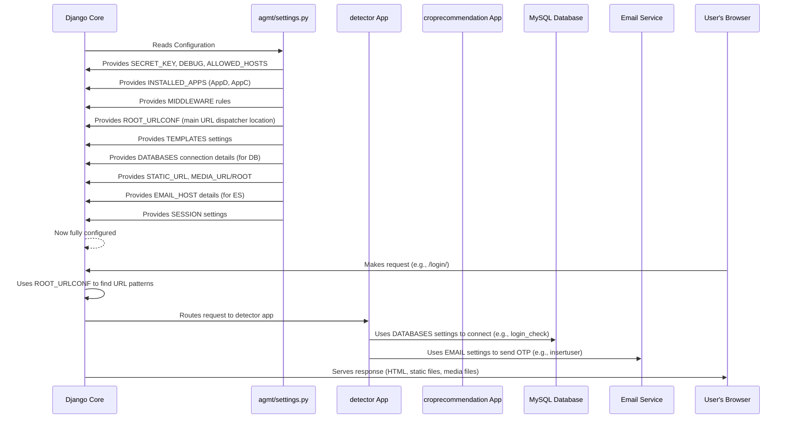

# Chapter 6: Django Project Configuration

Welcome back, digital farmers! In our previous chapters, we explored many exciting features of the Agri-Management-System: from [User Authentication & Management](01_user_authentication___management_.md) to the [Plant Disease Diagnoser](03_plant_disease_diagnoser_.md), [Smart Crop Advisor](04_smart_crop_advisor_.md), and the [Agricultural Market Price Monitor](05_agricultural_market_price_monitor_.md). We also learned how the [Web Address Router (URL Dispatcher)](02_web_address_router__url_dispatcher__.md) guides you through all these features.

But have you ever wondered how all these different parts of our system, like database connections, email services, and our custom applications, know how to work together? How does Django know which database to use, or where to find your custom apps?

This is where **Django Project Configuration** comes in!

### What Problem Does Django Project Configuration Solve?

Think of our entire Agri-Management-System as a complex machine, like a tractor. A tractor has many different parts: an engine, wheels, lights, a steering wheel, and various controls. For everything to work correctly, these parts need to be assembled and configured according to a main blueprint or a central control panel.

Our Django project is similar. It has many "parts" (our apps like `detector` and `croprecommendation`, the database, email sending, static files like CSS and images, and more). The **Django Project Configuration** file, typically named `settings.py`, is exactly that: the **main control panel or blueprint** for our entire system.

It solves the problem of:

*   **Centralized Control:** All the fundamental settings for the entire project are in one place.
*   **System Assembly:** It tells Django which components (like our apps) are part of the system.
*   **External Connections:** It defines how to connect to external services like our MySQL database or an email server.
*   **Security & Performance:** It holds important security keys and debug settings that impact how our system runs.

Any fundamental change to how the whole system operates, such as adding a new app, changing database credentials, or setting up email, starts right here in `settings.py`.

### Key Concepts

Let's break down the main ideas you'll find in a Django `settings.py` file:

*   **`BASE_DIR`**: This is a variable that points to the main folder of your project. It helps Django find other files relative to your project's root.
*   **`SECRET_KEY`**: A super important, long, random string used for cryptographic signing. It's like the master key to your house – keep it secret!
*   **`DEBUG`**: A True/False switch. `True` is for development (it shows detailed error pages), `False` is for live production (it hides sensitive errors).
*   **`INSTALLED_APPS`**: A list of all the applications (both Django's built-in ones and our custom apps like `detector`) that are part of this project.
*   **`DATABASES`**: This is where we tell Django all the details about our database connection, like the type of database (MySQL), its name, username, and password.
*   **`STATIC_URL`**: Defines the web address where static files (like CSS, JavaScript, and images) can be found.
*   **`MEDIA_URL` & `MEDIA_ROOT`**: Define where user-uploaded files (like the plant images in our [Plant Disease Diagnoser](03_plant_disease_diagnoser_.md)) are stored and accessed.
*   **`EMAIL_HOST` & `EMAIL_HOST_USER`**: Settings for sending emails, which we use for OTP verification in [User Authentication & Management](01_user_authentication___management_.md).
*   **`ROOT_URLCONF`**: Tells Django where to find the main [Web Address Router (URL Dispatcher)](02_web_address_router__url_dispatcher__.md) file (`urls.py`).
*   **`MIDDLEWARE`**: A list of "helper" programs that process requests coming into our system and responses going out. They handle things like security, sessions, and user authentication.
*   **`TEMPLATES`**: Tells Django where to look for our HTML template files.

### How it Works: The Central Control Panel

Let's imagine you want to make a fundamental change to our Agri-Management-System. Here's how `settings.py` acts as the central control panel:

#### Use Case: Connecting to a MySQL Database

Our Agri-Management-System uses a MySQL database to store information like user accounts and disease remedies. But how does Django know to use MySQL, and what are the login details?

1.  **The Need:** You want your project to talk to a specific MySQL database named `django_db` on your local machine.
2.  **The Solution (`settings.py`):** You would open `settings.py` and configure the `DATABASES` section.

    ```python
    # Part of agmt/agmt/settings.py
    DATABASES = {
        "default": {
            "ENGINE": "django.db.backends.mysql", # Tells Django to use MySQL
            "NAME": 'django_db',                  # The name of your database
            'USER' : 'root',                      # Username to access the database
            'PASSWORD' : 'root',                  # Password for the database user
            'HOST' : 'localhost',                 # Where the database is running (local computer)
            'PORT' : '3306'                       # The port number MySQL usually uses
        }
    }
    ```
    *   Here, `"default"` means this is the primary database.
    *   `"ENGINE"` specifies that we're using MySQL.
    *   `"NAME"`, `"USER"`, `"PASSWORD"`, `"HOST"`, and `"PORT"` provide all the necessary credentials for Django to establish a connection.
3.  **The Result:** Now, whenever any part of our system (like saving a new user from [User Authentication & Management](01_user_authentication___management_.md) or looking up a remedy for the [Plant Disease Diagnoser](03_plant_disease_diagnoser_.md)) needs to interact with the database, Django uses these exact settings to connect to the correct MySQL database.

This demonstrates how `settings.py` is the go-to place for all project-wide configurations.

### Behind the Scenes: The Project's Blueprint (`agmt/agmt/settings.py`)

Let's take a detailed look at the `settings.py` file to understand how it configures our entire Agri-Management-System.


This diagram illustrates how, when Django first starts or handles a request, it consults the `settings.py` file to understand how the entire project is put together and how its various components should operate.

Now let's go through the key sections of our `agmt/agmt/settings.py` file:

#### 1. Project Basics

```python
# File: agmt/agmt/settings.py

# Build paths inside the project like this: BASE_DIR / 'subdir'.
BASE_DIR = Path(__file__).resolve().parent.parent

# SECURITY WARNING: keep the secret key used in production secret!
SECRET_KEY = "django-insecure-syt*bt9qh7*luvuc^@(ei2@d*73m6tk$9%#kt7szkui1$*r!n7"

# SECURITY WARNING: don't run with debug turned on in production!
DEBUG = True

ALLOWED_HOSTS = []
```
*   `BASE_DIR`: This line automatically figures out the main folder of our project. It's super useful for finding other files within our project.
*   `SECRET_KEY`: This is a unique security code for our project. It's like a special password Django uses for security-related tasks, such as generating tokens. **Never share this key in a real project!**
*   `DEBUG = True`: While developing, `DEBUG` is `True`. This means Django will show detailed error messages if something goes wrong, which is helpful for fixing bugs. In a live system, this should always be `False` for security.
*   `ALLOWED_HOSTS = []`: This list defines which web addresses (domain names like `agri.com`) are allowed to serve our Django project. For now, it's empty, meaning only `localhost` is allowed (common for development).

#### 2. Registering Our Applications

```python
# File: agmt/agmt/settings.py

INSTALLED_APPS = [
    "django.contrib.admin",
    "django.contrib.auth",
    "django.contrib.contenttypes",
    "django.contrib.sessions",
    "django.contrib.messages",
    "django.contrib.staticfiles",
    "detector",         # Our custom app for user auth, disease detection, prices
    "croprecommendation" # Our custom app for crop recommendations
]
```
*   `INSTALLED_APPS`: This is a very important list! It tells Django about all the "applications" that are part of our big project.
    *   The first few are built-in Django apps that provide core functionalities like user management (`auth`), sessions (`sessions`), and admin pages (`admin`).
    *   `"detector"`: This is our main custom application, containing features like [User Authentication & Management](01_user_authentication___management_.md), [Plant Disease Diagnoser](03_plant_disease_diagnoser_.md), and [Agricultural Market Price Monitor](05_agricultural_market_price_monitor_.md).
    *   `"croprecommendation"`: This is our custom application for the [Smart Crop Advisor](04_smart_crop_advisor_.md).
*   Whenever you create a new app, you *must* add its name to this list so Django knows it exists and can use its models, views, and templates.

#### 3. Middleware: The Request/Response Helpers

```python
# File: agmt/agmt/settings.py

MIDDLEWARE = [
    "django.middleware.security.SecurityMiddleware",
    "django.contrib.sessions.middleware.SessionMiddleware",
    "django.middleware.common.CommonMiddleware",
    "django.middleware.csrf.CsrfViewMiddleware",
    "django.contrib.auth.middleware.AuthenticationMiddleware",
    "django.contrib.messages.middleware.MessageMiddleware",
    "django.middleware.clickjacking.XFrameOptionsMiddleware",
]
```
*   `MIDDLEWARE`: These are like a series of filters or "checkpoints" that every request passes through *before* it reaches our views, and every response passes through *before* it's sent back to the user.
    *   They handle tasks like security checks (`SecurityMiddleware`), managing user sessions (`SessionMiddleware` for things like storing OTPs and selected commodities), and protecting against common web attacks (`CsrfViewMiddleware`).

#### 4. URL Routing & Templates

```python
# File: agmt/agmt/settings.py

ROOT_URLCONF = "agmt.urls"

TEMPLATES = [
    {
        "BACKEND": "django.template.backends.django.DjangoTemplates",
        "DIRS": [],
        "APP_DIRS": True, # Tells Django to look for templates inside each app's 'templates' folder
        "OPTIONS": {
            "context_processors": [
                "django.template.context_processors.debug",
                "django.template.context_processors.request",
                "django.contrib.auth.context_processors.auth",
                "django.contrib.messages.context_processors.messages",
            ],
        },
    },
]
```
*   `ROOT_URLCONF = "agmt.urls"`: This line tells Django to start looking for web addresses (URLs) in the `urls.py` file located inside the main `agmt` project folder. This is the main [Web Address Router (URL Dispatcher)](02_web_address_router__url_dispatcher__.md) that then points to our app-specific `urls.py` files.
*   `TEMPLATES`: This configures how Django finds and processes our HTML templates. `"APP_DIRS": True` is important because it means Django will automatically look for templates inside a `templates` folder within *each* of our `INSTALLED_APPS`.

#### 5. Database Connection

```python
# File: agmt/agmt/settings.py

DATABASES = {
    "default": {
        "ENGINE": "django.db.backends.mysql",
        "NAME": 'django_db',
        'USER' : 'root',
        'PASSWORD' : 'root',
        'HOST' : 'localhost',
        'PORT' : '3306'
    }
}
```
*   `DATABASES`: As discussed in our use case, this is where we specify all the details to connect to our MySQL database. This is essential for our [Database Models](07_database_models_.md) to work.

#### 6. Static and Media Files

```python
# File: agmt/agmt/settings.py

# Static files (CSS, JavaScript, Images)
STATIC_URL = "static/"

# MEDIA_URL is the public web address prefix for user-uploaded files
MEDIA_URL = '/media/'  
# MEDIA_ROOT is the actual folder on the server where uploaded files are stored
MEDIA_ROOT = os.path.join(BASE_DIR, 'media')
```
*   `STATIC_URL`: When your browser sees `static/style.css`, this setting helps Django know that `static/` refers to files like our CSS, JavaScript, and pre-built images. For example, the graph generated by our [Agricultural Market Price Monitor](05_agricultural_market_price_monitor_.md) is saved as a static image.
*   `MEDIA_URL` and `MEDIA_ROOT`: These are crucial for handling files that users upload.
    *   `MEDIA_URL = '/media/'`: This is the web address path (e.g., `agri.com/media/my_plant.jpg`) where uploaded files will be accessible.
    *   `MEDIA_ROOT = os.path.join(BASE_DIR, 'media')`: This specifies the actual physical folder on our server where Django should save the uploaded files. For example, when a farmer uploads an image for the [Plant Disease Diagnoser](03_plant_disease_diagnoser_.md), it gets saved here.

#### 7. Email Settings

```python
# File: agmt/agmt/settings.py

EMAIL_HOST='smtp.gmail.com'
EMAIL_PORT=587
EMAIL_HOST_USER='alloteasyregofficial@gmail.com'
EMAIL_HOST_PASSWORD='qkxh hiha ohfl tcgw '
EMAIL_USE_TLS=True
EMAIL_BACKEND='django.core.mail.backends.smtp.EmailBackend'
```
*   These settings configure how our Django project sends emails. We use a Gmail SMTP server here.
*   `EMAIL_HOST_USER` and `EMAIL_HOST_PASSWORD`: These are the credentials for the email account our system uses to send emails. This is vital for the OTP verification process in [User Authentication & Management](01_user_authentication___management_.md).
*   `EMAIL_USE_TLS=True`: Ensures that email communication is encrypted and secure.

#### 8. Session Management

```python
# File: agmt/agmt/settings.py

# Use database-backed sessions (default in Django)
SESSION_ENGINE = "django.contrib.sessions.backends.db"

# Ensure the session is saved even if it’s unchanged
SESSION_SAVE_EVERY_REQUEST = True

# Set session expiration (default is browser-close session)
SESSION_COOKIE_AGE = 3600  # 1 hour
SESSION_EXPIRE_AT_BROWSER_CLOSE = False
```
*   `SESSION_ENGINE`: Sessions are like a temporary memory for each user's visit. This tells Django to store session data (like the temporary OTP during registration, or selected commodities) in the database.
*   `SESSION_SAVE_EVERY_REQUEST`: This ensures that session data is always saved, even if it hasn't changed.
*   `SESSION_COOKIE_AGE`: Sets how long a session should last (here, 3600 seconds = 1 hour).
*   `SESSION_EXPIRE_AT_BROWSER_CLOSE`: If `False`, the session remains active even if the user closes and reopens their browser (until `SESSION_COOKIE_AGE` is reached).

### Conclusion

In this chapter, we've uncovered the core of our Agri-Management-System: **Django Project Configuration**. We learned that the `settings.py` file acts as the project's central blueprint, defining how all the different parts of our system, from applications and databases to email services and static files, are set up and connected. Understanding `settings.py` is like knowing the instruction manual for the entire project, allowing us to build, extend, and manage our agricultural tools effectively.

With a firm grasp of the project's configuration, we're ready to dive deeper into how our data is actually structured and stored. Next, we'll explore [Chapter 7: Database Models](07_database_models_.md), where we'll learn about the blueprints for our data.

---

<sub><sup>**References**: [[1]](https://github.com/itz-me-pandian/Agri-Management-System/blob/23cac15d4ba833e8d5a77db1b8269b72e3f1e993/agmt/agmt/settings.py)</sup></sub>