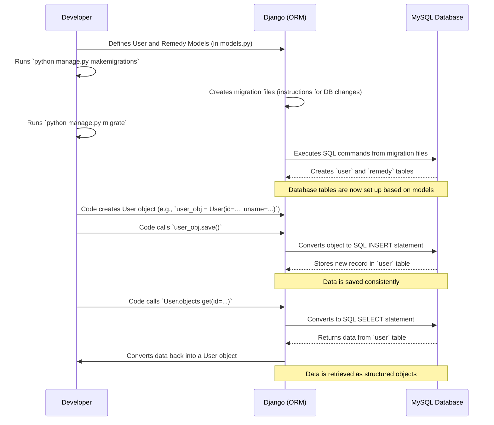

# Chapter 7: Database Models

Welcome back, digital farmers! In our previous chapter, [Chapter 6: Django Project Configuration](06_django_project_configuration_.md), we configured the brain of our Agri-Management-System, telling it how to connect to our MySQL database. But connecting to the database is just the first step! Once connected, how does our system know *what kind* of information to store, and *how* to organize it within that database?

This is where **Database Models** come in!

### What Problem Do Database Models Solve?

Imagine you're trying to organize a huge filing cabinet for all your farm records. If you just throw everything in randomly – some papers with just names, others with addresses but no names, and some with half-finished details – it would be impossible to find anything or ensure your records are complete. You need a clear structure for each type of record: "Farmer Records" should always have a name, contact, and email; "Crop Records" need a type, planting date, and yield, etc.

Our database is like that filing cabinet. Without a clear plan for how to store different types of information, it would quickly become a messy and unusable jumble.

**Database Models** solve this crucial problem by acting as **blueprints or templates** for your data. They define:

*   **What information to store:** For a farmer, do we need their name, email, password, contact number?
*   **The type of information:** Is a farmer's name text? Is their contact a number? Is an email an email format?
*   **How to organize it:** Each blueprint becomes a separate "folder" or "table" in our database, ensuring consistency.

For example, our Agri-Management-System needs to store details about farmers (like their name, email, password, and contact) and information about plant diseases (like their name, cause, and remedy). Database models ensure that every time we save a new farmer's details or a new disease remedy, it follows the exact same structure.

### Key Concepts

Let's break down the main ideas behind Database Models in Django (the framework we use):

*   **Model:** This is the core blueprint. In Django, a Model is a Python class that defines the structure of a specific type of data that will be stored in your database. Think of it as the design for a "Farmer Record" or a "Disease Remedy Record."
*   **Fields:** These are the specific pieces of information that each model will hold. For a "Farmer Record" model, fields would be things like `name`, `email`, `password`, etc. For a "Disease Remedy Record" model, fields would be `disease_name`, `disease_cause`, `remedy_description`, etc.
    *   **`CharField`**: Used for short to medium-length text, like names, types, or causes. You usually specify a `max_length`.
    *   **`EmailField`**: A special type of `CharField` that also validates if the text looks like an email address.
    *   **`models.Model`**: This is what your custom models inherit from. It gives them all the special powers to interact with the database.
*   **Database Table:** When you define a Django Model, Django automatically creates a corresponding "table" in your actual database. Each table is designed to hold records that match your model's blueprint.
*   **Object (or Record/Row):** An actual piece of data stored in the database, following the blueprint of your model. For example, if your `User` model is the blueprint, then *your specific farmer account* in the database is a `User` object or record.

### How to Define Database Models in Our System

Let's look at the actual blueprints (models) used in our Agri-Management-System to store user information and disease remedies. These models are defined in the `agmt/detector/models.py` file.

#### 1. The `User` Model: Blueprint for Farmer Accounts

This model defines what information we store for each farmer who registers and logs into our system. It's like the blueprint for a "Farmer's ID Card."

```python
# File: agmt/detector/models.py

from django.db import models

class User(models.Model):
    # This stores the farmer's name
    uname = models.CharField(max_length=30)
    # This stores the farmer's password
    upass = models.CharField(max_length=25, default='')
    # This stores the farmer's email address
    uemail = models.EmailField()

    def __str__(self):
        return self.uname
    
    class Meta:
        # This tells Django to name the database table "user"
        db_table = "user"
```
*   `class User(models.Model):`: This line declares our `User` model. By inheriting from `models.Model`, it gets all the necessary tools to interact with the database.
*   `uname = models.CharField(max_length=30)`: This defines a field named `uname` (for "user name"). It's a `CharField` (text field) and can store up to 30 characters.
*   `upass = models.CharField(max_length=25, default='')`: This is for the farmer's password.
*   `uemail = models.EmailField()`: This is for the farmer's email. `EmailField` automatically checks if the input is a valid email format.
*   **`id` Field**: You might notice there's no `id` field. Django automatically adds an `id` field as the primary key (a unique identifier, usually a number) to every model. In our system, the farmer's contact number (provided during registration) is used as this `id` when creating a `User` object.
*   `def __str__(self):`: This is a special Python method that defines how an object of this model should be represented as a string (e.g., when you print it or see it in Django's admin panel). Here, it will show the farmer's name.
*   `class Meta: db_table = "user"`: This tells Django to explicitly name the corresponding table in the database as `"user"`. If we didn't specify this, Django would automatically name it `detector_user` (based on the app name and model name).

#### 2. The `Remedy` Model: Blueprint for Disease Information

This model defines the structure for storing all the details about different plant diseases and their remedies, used by our [Plant Disease Diagnoser](03_plant_disease_diagnoser_.md).

```python
# File: agmt/detector/models.py

from django.db import models

class Remedy(models.Model):
    # This stores the specific name of the disease
    dname = models.CharField(max_length=100)
    # This stores whether the disease is Spreadable or Not Spreadable
    dtype = models.CharField(max_length=100)
    # This describes what causes the disease (e.g., Fungal infection)
    dcause = models.CharField(max_length=200)
    # This contains the instructions for treating the disease
    dremedy = models.CharField(max_length=200)

    class Meta:
        # This tells Django to name the database table "remedy"
        db_table = "remedy"
```
*   `class Remedy(models.Model):`: This declares our `Remedy` model.
*   `dname = models.CharField(max_length=100)`: For the disease name.
*   `dtype = models.CharField(max_length=100)`: For the disease type (e.g., "Spreadable").
*   `dcause = models.CharField(max_length=200)`: For the cause of the disease.
*   `dremedy = models.CharField(max_length=200)`: For the detailed remedy instructions.
*   Again, Django will automatically add an `id` field as the primary key for each remedy entry.
*   `class Meta: db_table = "remedy"`: Names the database table `"remedy"`.

These models provide a clear, consistent, and structured way to handle all our application's data!

### Behind the Scenes: From Blueprint to Database

Now, let's peek under the hood to understand how these Python model blueprints become actual tables in our MySQL database and how our application uses them.

#### The Overall Flow: Models to Data



This diagram illustrates the journey: you define models in Python, Django translates them into database instructions, and then your application can use these models to easily save and retrieve structured data without writing complex SQL code directly. This is often called an **ORM (Object-Relational Mapper)** – it maps Python objects to database tables.

#### 1. Defining Models (as shown above)

First, we write the `User` and `Remedy` classes in `agmt/detector/models.py`.

#### 2. Creating Database Tables (`makemigrations` and `migrate`)

After you define your models (or make any changes to them), you tell Django to prepare the database changes. These are two commands you run in your terminal:

*   **`python manage.py makemigrations`**: This command looks at your models and detects any changes you've made (like adding a new model or a new field to an existing model). It then creates a "migration file" – a set of instructions that tell Django how to update your database schema.
*   **`python manage.py migrate`**: This command takes the migration files and applies those changes to your actual database. It's what creates the `user` and `remedy` tables in your MySQL database, exactly matching the structure defined in your Python models.

You only need to run these commands when you change your model definitions.

#### 3. Using Models in Python Code (Views)

Once the database tables are set up, our Python code (specifically our **Views**, as discussed in previous chapters) can use these models to easily interact with the database.

##### Saving a New User (from [User Authentication & Management](01_user_authentication___management_.md))

When a farmer's OTP is verified, the system saves their details to the `user` table using the `User` model:

```python
# File: agmt/detector/views.py (simplified - from otp_verify function)
from .models import User # Our User blueprint

# ... (inside otp_verify function, after OTP is verified) ...

# Retrieve farmer's details from session
vuid = request.session.get('vuid')
vuname = request.session.get('vuname')
vuemail = request.session.get('vuemail')
vupass = request.session.get('vpass')

# Create a new User object using our blueprint
us = User(id=vuid, uname=vuname, upass=vupass, uemail=vuemail)
us.save() # Save the new farmer's account to the database!
```
*   `us = User(...)`: Here, we create an "instance" (a specific record) of our `User` model. We pass the data (like `vuid` for `id`, `vuname` for `uname`) to match the model's fields.
*   `us.save()`: This simple command tells Django to take this `us` object and save its data into the `user` table in the database. Django automatically handles converting the Python object into an SQL `INSERT` statement.

##### Retrieving a User (from [User Authentication & Management](01_user_authentication___management_.md))

When a farmer tries to log in, the system retrieves their details from the `user` table to verify them:

```python
# File: agmt/detector/views.py (simplified - from login_check function)
from .models import User # Our User blueprint

# ... (inside login_check function) ...

id = request.POST.get('contact_number') # Get contact ID from login form

try:
    # Try to find a user in the database using the provided contact ID
    user = User.objects.get(id=id) # Retrieve a User object by its 'id'
except User.DoesNotExist:
    # If no user found, handle the error
    pass # ... (error handling code omitted)
```
*   `User.objects.get(id=id)`: This is how we ask Django to fetch a specific `User` record from the database. `objects` is Django's manager that provides methods to query the database. `get(id=id)` tells it to find one `User` whose `id` field matches the `id` value we provided.
*   If a user is found, Django converts the database row into a `User` Python object, which we store in the `user` variable. We can then access its fields like `user.upass` or `user.uname`.

##### Retrieving a Remedy (from [Plant Disease Diagnoser](03_plant_disease_diagnoser_.md))

Similarly, when the plant disease diagnoser needs to show a remedy, it fetches it from the `remedy` table:

```python
# File: agmt/detector/views.py (simplified - from read function)
from .models import Remedy # Our Remedy blueprint

def read(disease_name):
    # Finds the matching disease entry in the database
    data = Remedy.objects.get(dname=disease_name) # Retrieve a Remedy object by its 'dname'
    # Returns the disease name, cause, type, and remedy
    return data.dname, data.dcause, data.dtype, data.dremedy
```
*   `Remedy.objects.get(dname=disease_name)`: Here, we retrieve a `Remedy` object from the database by matching its `dname` field.
*   The `data` variable then holds a `Remedy` object, allowing us to easily access `data.dname`, `data.dcause`, etc.

### Conclusion

In this chapter, we demystified **Database Models**, the essential blueprints that define the structure of our data in the Agri-Management-System. We learned how Django Models, using fields like `CharField` and `EmailField`, translate into actual tables in our MySQL database. This structured approach ensures data consistency and makes it incredibly easy for our application to store, retrieve, and manage all the vital information, from farmer accounts to plant disease remedies. Models are truly the foundation of any data-driven application, allowing us to interact with our database using simple Python code rather than complex database commands.

---

<sub><sup>**References**: [[1]](https://github.com/itz-me-pandian/Agri-Management-System/blob/23cac15d4ba833e8d5a77db1b8269b72e3f1e993/agmt/croprecommendation/models.py), [[2]](https://github.com/itz-me-pandian/Agri-Management-System/blob/23cac15d4ba833e8d5a77db1b8269b72e3f1e993/agmt/detector/models.py)</sup></sub>